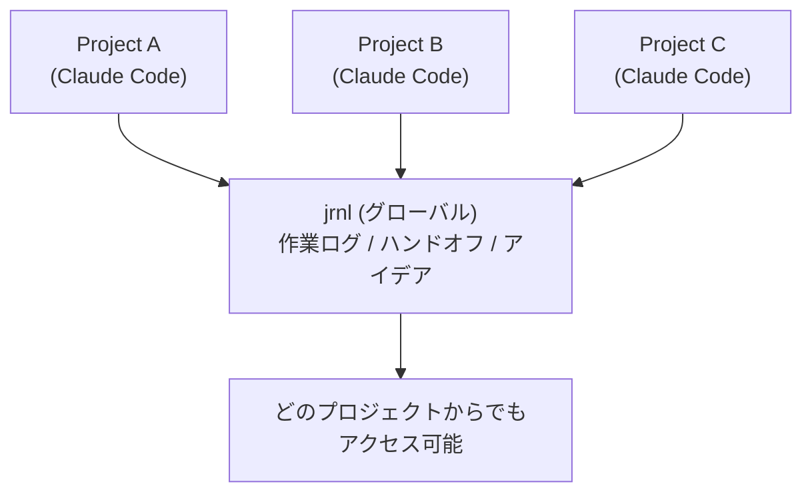
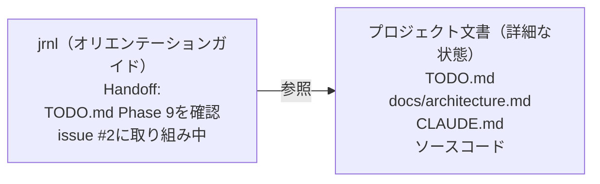

## TL;DR

- CLIジャーナルツール[jrnl](https://jrnl.sh/)を使ってClaude Codeが会話(セッション)ごとに忘却した記憶を引き継ぐClaude Codeのプラグイン **[jrnl-tools](https://github.com/yostos/claude-code-plugins/tree/main/plugins/jrnl-plugin)** を紹介
- セッション終了時に`/jrnl-handoff`で作業状態を記録し、翌日`/jrnl-restore`で復元
- プロジェクト横断の状況一覧や時系列の作業履歴も可能
- 2026年2月5日にリリースされた **Auto Memory** との棲み分けも解説

## きっかけ — MCPからプラグインへ、そして活用法の発見

Claude Codeで複雑なリファクタリングを進めていて、途中でセッションを閉じる必要がありました。翌日セッションを再開すると、Claude Codeは何も覚えていません。「昨日の続きをお願い」と言っても、ゼロから説明し直す羽目になりました。

筆者は以前から、日々の作業を記録するために[jrnl](https://jrnl.sh/)というCLIジャーナルツールを使っていました[^jrnl-mcp]。ターミナルから`jrnl "今日はXXを調査した"`と打つだけで記録が残る、その手軽さを気に入っていたからです。

セッション記憶喪失の体験と、普段使いのjrnl。この2つが頭の中でつながりました。**jrnlが自分への備忘録として機能するなら、Claude Codeへの備忘録としても使えるのではないか。** セッション終了時にjrnlへ引き継ぎメモを書き、翌日のセッションでそれを読み込ませれば、文脈を引き継げるはずです。

このアイデアがjrnl-toolsプラグインの出発点です。

## Claude Codeの「記憶」の限界

Claude Codeは強力な開発パートナーです。コードを読み、修正し、テストを回し、アーキテクチャの議論まで一緒にしてくれます。しかし、セッション固有の文脈には根本的な制約があります。

Claude Codeには`CLAUDE.md`という永続的な設定ファイルがあり、プロジェクトのルールや規約はセッションを超えて引き継げます。しかし、**「昨日のセッションで何を議論し、どこまで進み、次に何をする予定だったか」というセッション固有のコンテキストは引き継がれません。**

昨日2時間かけてデバッグした認証バグの調査過程、設計判断の理由、「次にやること」の合意。セッションを閉じた瞬間、それらは消えます。翌朝、新しいセッションを開くと、Claude Codeはプロジェクトのルールは知っていても、昨日の作業状況は知りません。

「それなら`claude --resume`や`claude --continue`でセッションを再開すればいいのでは？」と思うかもしれません。確かに、これらのコマンドは会話履歴をそのまま復元できる強力な機能です。しかし、セッション再開には以下の制約があります。

- **同一ディレクトリ限定** — セッションはディレクトリに紐付いており、別プロジェクトのセッションは再開できない
- **コンテキストウィンドウの制約** — 長いセッションはコンパクト化され、過去の議論の詳細は失われていく
- **検索性がない** —「先月の認証バグ調査」を後から探すことはできない。セッション履歴は蓄積される知識にならない

そもそも、膨大に膨らんだセッションのコンテキストをそのまま次回に引き継ぎたいわけではありません。必要なのは「何が完了し、何が残っていて、次にどこから始めるか」という要点です。セッション再開は「中断した作業の直接的な続行」には向いていますが、「要点を絞った引き継ぎ」や「長期的な作業記録」には対応していません。

さらに、複数プロジェクトを並行して進めている開発者にとって、問題は深刻です。Claude Codeはプロジェクト（ディレクトリ）単位で動作するため、プロジェクトAで作業しているときにプロジェクトBの状況を知る方法がありません。

つまり、足りていないのは以下の2つです。

- **セッションの要点を構造化して引き継ぐ仕組み** — 何を議論し、どこまで進み、次に何をするかを簡潔に次のセッションに伝える手段
- **プロジェクトの壁を超えた横断的な状況把握** — どのプロジェクトからでも、他のプロジェクトの進捗を確認できる手段

これらを既存のCLIツールで実現できないかと考えたとき、冒頭で触れたjrnlの存在が頭に浮かびました。

## jrnlという選択 — CLIジャーナルが架け橋になる

[jrnl](https://jrnl.sh/) はコマンドラインで動くシンプルなジャーナルツールです。テキストベースで、タグ付けができ、日付によるフィルタリングが可能です。

```bash
jrnl "認証バグの原因はトークンリフレッシュ処理にあった @api @log"
```

たったこれだけで、タイムスタンプ付きのエントリが記録されます。このシンプルさがClaude Codeとの統合に適しています。

jrnl-toolsが目指すのは、**jrnlをClaude Codeセッション間の「フロー情報ハブ」にすること**です。



各プロジェクトのClaude Codeセッションからjrnlに書き込み、別のプロジェクトや翌日のセッションからそれを読み出す。jrnlがプロジェクトとセッションの壁を超える共有レイヤーになります。組み込みのメモリ機能にはない、jrnlならではの特性は以下の通りです。

- **クロスプロジェクト横断** — jrnlはグローバルなので、どのプロジェクトからでも全プロジェクトの状況を把握できる
- **時系列の作業履歴** — エントリは日付付きで蓄積され、後から検索・振り返りができる
- **Claude Code外からもアクセス可能** — `jrnl @handoff`のように、ターミナルから直接検索・閲覧できる
- **ユーザーが完全に制御可能** — エントリはプレーンテキストであり、内容の確認・編集・削除を自分で管理できる

## 「オリエンテーションガイド」という設計思想

jrnl-toolsの設計で最も重要な考え方があります。

**ハンドオフは「状態のダンプ」ではなく「オリエンテーションガイド」です。**

最初は、セッションの全状態をjrnlに保存しようと考えました。しかし実際に使ってみると、複雑なセッションほど圧縮されて読みにくいエントリになり、結局役に立ちません。

そこで発想を転換しました。プロジェクトの詳細な状態は、TODO.md、設計ドキュメント、コード自体に既に存在しています。次のセッションのAIに必要なのは「どこを見ればいいか」という案内図です。



良いハンドオフとは、次のセッションが「どのファイルを読めばいいか」「何が進行中だったか」を瞬時に把握できるものです。すべてを記録する必要はありません。プロジェクトファイルが永続的な状態を持っているからです。

## jrnl-toolsの4つのコマンド

jrnl-toolsプラグインは、4つのスラッシュコマンドを提供します。

### `/jrnl-handoff` — 明日の自分への引き継ぎ

作業を終えるとき、このコマンドを実行します。Claude Codeがセッションの内容を分析し、次のセッション向けのオリエンテーションガイドを生成します。

```
> /jrnl-handoff
```

生成されるエントリの例は以下のようになります。

```
Handoff: 認証ミドルウェアのリファクタリング完了 @api-server @handoff
Progress:
- トークンリフレッシュロジックを修正（auth.ts:45-78）
- ログイン/ログアウトフローのテストがパス
Files changed:
- src/middleware/auth.ts
- tests/auth.test.ts
Blockers:
- None
Next:
- /api/usersにレート制限を実装（TODO.md item 3参照）
- APIドキュメントの更新（docs/api-spec.md参照）
```

gitリポジトリ内では、`git diff --name-only`と`git status`の情報も自動的に取り込まれ、変更ファイルの一覧が正確に記録されます。

### `/jrnl-restore` — 前回の続きから再開

翌朝、あるいは数日ぶりにプロジェクトを開いたとき、このコマンドで前回の状態を復元します。

```
> /jrnl-restore
```

Claude Codeは以下のステップで動作します。

1. jrnlから最新のハンドオフを取得
2. ハンドオフに記載されたファイル（TODO.md、ドキュメントなど）を実際に読み込み
3. gitリポジトリなら、ハンドオフ以降のコミットや未コミットの変更も確認
4. これらを総合して「前回の続き」として提示

ハンドオフが古くなっていても問題ありません。ハンドオフはあくまでスタート地点であり、AIがプロジェクトファイルを読んで最新の状態を把握します。

### `/jrnl-status` — 全プロジェクト横断ビュー

複数プロジェクトを並行している開発者にとって、これが最も価値のあるコマンドかもしれません。

```
> /jrnl-status
```

過去7日間（デフォルト）のハンドオフから、全プロジェクトの状況を一覧表示します。

```
Projects (last 7 days):

@api-server (2026-02-10)
  Status: 認証ミドルウェアのリファクタリング完了
  Next: レート制限の実装

@mobile-app (2026-02-08)
  Status: プッシュ通知の統合完了
  Next: iOSバッジ数のバグ修正

@docs-site (2026-02-06)
  Status: 新テーマへの移行がブロック中
  Next: デザインチームのアセット待ち
```

月曜朝の計画や週次レビューで威力を発揮します。`/jrnl-status 30`で過去30日に拡張できます。

### `/jrnl-log` — 作業記録の自動生成

セッション中の作業を振り返って記録します。

```
> /jrnl-log
```

Claude Codeがセッション内容を分析し、作業ログを自動生成します。

```
Log: 認証バグ3件修正とOAuthテスト追加 @api-server @log
Completed:
- 認証バグ修正（issues #45, #47, #48）
- トークンリフレッシュに指数バックオフを導入
- OAuthフローの統合テスト追加
Decisions:
- リフレッシュトークンのTTLを24時間から72時間に変更
```

日報やスタンドアップの素材として、あるいは個人の振り返りとして活用できます。

## 自然言語でも使える

スラッシュコマンドだけでなく、自然言語でもjrnlと対話できます。

```
> ジャーナルに追加して：決済APIはバリデーションエラーでも200を返す。
  response.statusフィールドを確認する必要がある

> 先週のジャーナルを見せて

> 昨日何をしていた？

> 認証に関するジャーナルエントリを検索して
```

jrnlのコマンド体系を知らなくても、Claude Codeが適切なコマンドに変換して実行します。

## タグによる情報の分類

jrnl-toolsは、シンプルなタグ体系で情報を分類します。

| タグ         | 用途                           | 時間の向き |
| ------------ | ------------------------------ | ---------- |
| `@<project>` | プロジェクト識別（自動付与）   | -          |
| `@log`       | 過去の記録（作業、調査、判断） | 過去       |
| `@handoff`   | 次セッションへの引き継ぎ       | 未来       |
| `@idea`      | いつか検討するアイデア         | 不定       |

プロジェクトタグは`CLAUDE.md`に設定しておくと、自動的にすべてのエントリに付与されます。

```markdown
**jrnl Project Tag:** api-server
```

この仕組みにより、`jrnl @api-server`で特定プロジェクトのエントリだけを、`jrnl @handoff`でプロジェクト横断のハンドオフだけをフィルタリングできます。

## 1日のワークフロー

jrnl-toolsを使った典型的な1日の流れを紹介します。

朝はまず状況を把握し、文脈を復元します。

```
/jrnl-status          # 全プロジェクトの状況を確認
/jrnl-restore         # 今日のプロジェクトの前回状態を復元
```

作業中に気づいたことは、その場で記録します。

```
> ジャーナルに追加：キャッシュのTTLを5分にすると
  レスポンスタイムが40%改善した

> このアイデアを保存：将来的にGraphQL Subscriptionsで
  リアルタイム更新を実装すべき
```

夕方、作業を終える前に引き継ぎと記録を残します。

```
/jrnl-handoff         # 明日のセッションへの引き継ぎ
/jrnl-log             # 今日の作業記録（オプション）
```

この流れを習慣化すると、セッション間の文脈断絶がほぼなくなります。翌朝の「何やってたっけ？」が「はい、昨日の続きですね」に変わります。

## セットアップ

### 前提条件

- [jrnl](https://jrnl.sh/) がインストール済みであること
- Claude Codeが利用可能であること

### インストール

Claude Codeの`/plugin`コマンドからインストールします。

```bash
# マーケットプレイスを登録
/plugin marketplace add yostos/claude-code-plugins

# プラグインをインストール
/plugin install jrnl-tools@yostos-claude-code-plugins
```

### プロジェクトの設定

各プロジェクトの`CLAUDE.md`に、プロジェクトタグを追加します。

```markdown
**jrnl Project Tag:** myproject
```

これだけで準備完了です。設定していなくても、初回実行時にClaude Codeがプロジェクト名を聞いてくれます。

## 安全策と注意事項

jrnl-toolsは「壊さない」ことを重視して設計されています。

- **削除操作なし** — エントリの削除は不可。誤操作によるデータ消失を防止
- **暗号化操作なし** — パスワード処理のセキュリティリスクを回避
- **追記のみ** — 既存のエントリを変更しない。編集が必要な場合は`jrnl --edit`の使用をガイド

ただし、利用にあたって認識しておくべき点があります。

**機密情報の取り扱いに注意してください。** `/jrnl-handoff`や`/jrnl-log`はセッション内容を要約してjrnlに記録します。セッション中にAPIキーや認証情報を扱った場合、それらが要約に含まれる可能性があります。jrnlはデフォルトでプレーンテキスト保存のため、機密性の高いプロジェクトでは[jrnlの暗号化機能](https://jrnl.sh/en/stable/encryption/)の利用を推奨します。

**プロジェクト横断機能の情報分離にも配慮が必要です。** `/jrnl-status`は全プロジェクトの状況を横断表示する便利な機能ですが、裏を返せば異なるプロジェクトの情報が同じジャーナルに混在することを意味します。異なる機密レベルのプロジェクトを扱う場合は、この点を考慮してください。

## Auto Memoryの登場 — 公式機能との棲み分け

ここまでjrnl-toolsの設計と使い方を紹介してきました。しかし、このプラグインを開発していた2026年2月5日、状況が変わりました。Claude Code v2.1.32のリリースでAuto Memory[^auto-memory]という機能が追加されたのです。

「ハンドオフして」とClaude Codeに依頼するだけで、次のセッションへの引き継ぎ情報が`~/.claude/projects/`配下のメモリファイルに自動保存されます。プロジェクトのパターンや設定も自動的に記録され、次回セッション開始時にシステムプロンプトへ読み込まれます。セッション終了時に要点を自動記録するSession Memory[^session-memory]も含め、**同じプロジェクト内でのセッション引き継ぎは公式機能でカバーできるようになりました。**

正直に言えば、開発中のプラグインと公式機能の守備範囲が一部重なりました。では、jrnl-toolsは不要になったのでしょうか。

実際に使い比べてみると、両者の性質は異なっていました。

| 特性                        |             Auto Memory              |           jrnl-tools            |
| --------------------------- | :----------------------------------: | :-----------------------------: |
| 情報の性質                  |       ストック（安定した知識）       |     フロー（時系列の記録）      |
| 保存先                      |  プロジェクトごとのローカルファイル  |   グローバルなjrnlジャーナル    |
| スコープ                    |           単一プロジェクト           |       クロスプロジェクト        |
| 次セッションへの引き継ぎ    | 自動（システムプロンプトに読み込み） | 明示的（`/jrnl-restore`で復元） |
| 過去の作業履歴              |  新しい知見で上書き（約200行の自動読み込み枠）   |    日付付きで蓄積・検索可能     |
| Claude Code外からのアクセス |           想定されていない           |  `jrnl`コマンドで直接参照可能   |

Auto Memoryは**「プロジェクトの知識」**の永続化に優れています。コーディング規約、プロジェクト構造、ユーザーの好みといった安定した情報は、Auto Memoryに任せるのが最適です。

一方、jrnl-toolsは**「作業の記録」**に特化しています。「いつ何をしたか」「なぜその判断をしたか」という時系列の文脈は、Auto Memoryでは整理されて失われますが、jrnlには蓄積されていきます。`/jrnl-status`によるプロジェクト横断ビューも、プロジェクト単位で分離されたAuto Memoryでは実現できません。

両者は競合せず、補完関係にあります。

## まとめ

jrnl-toolsは、Claude Codeのセッションとプロジェクトの壁を超えた開発体験を実現するプラグインです。

- **プロジェクト間の壁を超える** → jrnlをハブにした横断ビューで、全プロジェクトの状況を一望
- **作業履歴を蓄積する** → 時系列のログとして検索・振り返りが可能
- **Claude Codeの外からもアクセスできる** → ターミナルから直接参照でき、独立したツールとして機能

Auto Memoryが「プロジェクトの知識」を、jrnlが「作業の記録」を担う。この棲み分けのもとで、開発者のワークフローはさらに改善されます。

jrnlのインストールとプラグインの導入は数分で完了します。まずは今日の作業を`/jrnl-handoff`で記録するところから始めてみてください。使ってみた感想や改善のアイデアがあれば、この記事のコメントやGitHubリポジトリのIssueで気軽にお聞かせください。

<https://github.com/yostos/claude-code-plugins>

[^auto-memory]: Auto Memoryは、Claude Code v2.1.32（2026年2月5日リリース）で追加された機能です。セッション中に発見したプロジェクトのパターンや設定を`~/.claude/projects/`配下のメモリファイルに自動保存し、次回セッションのシステムプロンプトに読み込みます。「ハンドオフして」と依頼すれば次にやるべきことも保存できます。詳細は[公式ドキュメント](https://code.claude.com/docs/en/memory)を参照してください。

[^jrnl-mcp]: 以前[jrnl-mcp](https://zenn.dev/yostos/articles/jrnl-mcp-introduction)というMCPサーバーを作り、Claude DesktopやClaude Codeからjrnlを操作できるようにしていました。Claude Codeのプラグインへ移植しようとした際、MCPのツールAPIを経由しなくてもClaude Codeならjrnlコマンドを直接実行できることに気づき、必要なのはAPIではなくワークフローの設計だという発想の転換がありました。
[^session-memory]: 2026年2月現在、Session Memoryは、Claude Code（Pro/Maxプラン、Anthropic API経由）がセッション終了時に会話の要点を自動的に記録し、同じプロジェクトの次回セッションで参照する機能です。ただしプロジェクトごとに分離されており、異なるプロジェクト間での共有はできません。Bedrock・Vertex・Foundry経由の利用ではフィーチャーフラグにより[無効化されています](https://github.com/anthropics/claude-code/issues/13706)。
