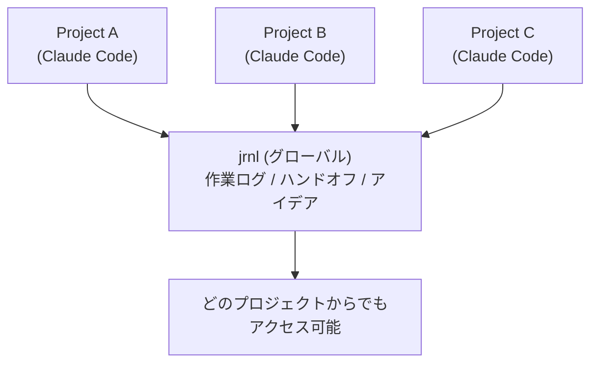
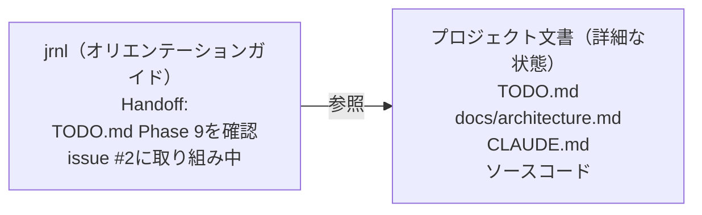

## きっかけ — 自分の備忘録がAIの記憶になる

筆者は以前から、日々の作業や出来事を記録するために[jrnl](https://jrnl.sh/)というCLIジャーナルツールを使っていました。ターミナルから`jrnl "今日はXXを調査した"`と打つだけで記録が残る、その手軽さを気に入っていたからです。

ある日、Claude Codeで複雑なリファクタリングを進めていて、途中でセッションを閉じる必要がありました。翌日セッションを再開すると、Claude Codeは何も覚えていません。「昨日の続きをお願い」と言っても、ゼロから説明し直す羽目になりました。

そのとき、ふと思いつきました。**jrnlが自分への備忘録として機能するなら、Claude Codeへの備忘録としても使えるのではないか。** セッション終了時にjrnlへ引き継ぎメモを書き、翌日のセッションでそれを読み込ませれば、文脈を引き継げるはずです。

このアイデアがjrnl-toolsプラグインの出発点です。

## Claude Codeの「記憶」の限界

Claude Codeは強力な開発パートナーです。コードを読み、修正し、テストを回し、アーキテクチャの議論まで一緒にしてくれます。しかし、セッション固有の文脈には根本的な制約があります。

Claude Codeには`CLAUDE.md`やAuto Memory[^auto-memory]といった永続化の仕組みが存在します。プロジェクトの一般的なルールや知識はこれらで引き継げます。しかし、**「昨日のセッションで何を議論し、どこまで進み、次に何をする予定だったか」というセッション固有のコンテキストは引き継がれません。**

昨日2時間かけてデバッグした認証バグの調査過程、設計判断の理由、「次にやること」の合意。セッションを閉じた瞬間、それらは消えます。翌朝、新しいセッションを開くと、Claude Codeはプロジェクトのルールは知っていても、昨日の作業状況は知りません。

「それなら`claude --resume`や`claude --continue`でセッションを再開すればいいのでは？」と思うかもしれません。確かに、これらのコマンドは会話履歴をそのまま復元できる強力な機能です。しかし、セッション再開には以下の制約があります。

- **同一ディレクトリ限定** — セッションはディレクトリに紐付いており、別プロジェクトのセッションは再開できない
- **コンテキストウィンドウの制約** — 長いセッションはコンパクト化され、過去の議論の詳細は失われていく
- **検索性がない** — 「先月の認証バグ調査」を後から探すことはできない。セッション履歴は蓄積される知識にならない

そもそも、膨大に膨らんだセッションのコンテキストをそのまま次回に引き継ぎたいわけではありません。必要なのは「何が完了し、何が残っていて、次にどこから始めるか」という要点です。セッション再開は「中断した作業の直接的な続行」には向いていますが、「要点を絞った引き継ぎ」や「長期的な作業記録」には対応していません。

さらに、複数プロジェクトを並行して進めている開発者にとって、問題は深刻です。Claude Codeはプロジェクト（ディレクトリ）単位で動作するため、プロジェクトAで作業しているときにプロジェクトBの状況を知る方法がありません。Session Memory[^session-memory]もセッション再開もプロジェクトごとに分離されており、横断的な状況把握はできません。

つまり、足りていないのは以下の2つです。

- **セッションの要点を構造化して引き継ぐ仕組み** — 何を議論し、どこまで進み、次に何をするかを簡潔に次のセッションに伝える手段
- **プロジェクトの壁を超えた横断的な状況把握** — どのプロジェクトからでも、他のプロジェクトの進捗を確認できる手段

これらを既存のCLIツールで実現できないかと考えたとき、冒頭で触れたjrnlの存在が頭に浮かびました。

## jrnlという選択 — CLIジャーナルが架け橋になる

[jrnl](https://jrnl.sh/) はコマンドラインで動くシンプルなジャーナルツールです。テキストベースで、タグ付けができ、日付によるフィルタリングが可能です。

```bash
jrnl "認証バグの原因はトークンリフレッシュ処理にあった @api @log"
```

たったこれだけで、タイムスタンプ付きのエントリが記録されます。このシンプルさがClaude Codeとの統合に適しています。

jrnl-toolsが目指すのは、**jrnlをClaude Codeセッション間の「フロー情報ハブ」にすること**です。



各プロジェクトのClaude Codeセッションからjrnlに書き込み、別のプロジェクトや翌日のセッションからそれを読み出す。jrnlがプロジェクトとセッションの壁を超える共有レイヤーになります。組み込みのメモリ機能にはない、jrnlならではの特性は以下の通りです。

- **クロスプロジェクト横断** — jrnlはグローバルなので、どのプロジェクトからでも全プロジェクトの状況を把握できる
- **ユーザーが完全に制御可能** — エントリはプレーンテキストであり、内容の確認・編集・削除を自分で管理できる
- **APIプロバイダ非依存** — Bedrock、Vertex、Foundry経由でClaude Codeを利用している場合でも動作する

## 「オリエンテーションガイド」という設計思想

jrnl-toolsの設計で最も重要な考え方があります。

**ハンドオフは「状態のダンプ」ではなく「オリエンテーションガイド」です。**

最初は、セッションの全状態をjrnlに保存しようと考えました。しかし実際に使ってみると、複雑なセッションほど圧縮されて読みにくいエントリになり、結局役に立ちません。

そこで発想を転換しました。プロジェクトの詳細な状態は、TODO.md、設計ドキュメント、コード自体に既に存在しています。次のセッションのAIに必要なのは「どこを見ればいいか」という案内図です。



良いハンドオフとは、次のセッションが「どのファイルを読めばいいか」「何が進行中だったか」を瞬時に把握できるものです。すべてを記録する必要はありません。プロジェクトファイルが永続的な状態を持っているからです。

## jrnl-toolsの4つのコマンド

jrnl-toolsプラグインは、4つのスラッシュコマンドを提供します。

### `/jrnl-handoff` — 明日の自分への引き継ぎ

作業を終えるとき、このコマンドを実行します。Claude Codeがセッションの内容を分析し、次のセッション向けのオリエンテーションガイドを生成します。

```
> /jrnl-handoff
```

生成されるエントリの例は以下のようになります。

```
Handoff: 認証ミドルウェアのリファクタリング完了 @api-server @handoff
Progress:
- トークンリフレッシュロジックを修正（auth.ts:45-78）
- ログイン/ログアウトフローのテストがパス
Files changed:
- src/middleware/auth.ts
- tests/auth.test.ts
Blockers:
- None
Next:
- /api/usersにレート制限を実装（TODO.md item 3参照）
- APIドキュメントの更新（docs/api-spec.md参照）
```

gitリポジトリ内では、`git diff --name-only`と`git status`の情報も自動的に取り込まれ、変更ファイルの一覧が正確に記録されます。

### `/jrnl-restore` — 前回の続きから再開

翌朝、あるいは数日ぶりにプロジェクトを開いたとき、このコマンドで前回の状態を復元します。

```
> /jrnl-restore
```

Claude Codeは以下のステップで動作します。

1. jrnlから最新のハンドオフを取得
2. ハンドオフに記載されたファイル（TODO.md、ドキュメントなど）を実際に読み込み
3. gitリポジトリなら、ハンドオフ以降のコミットや未コミットの変更も確認
4. これらを総合して「前回の続き」として提示

ハンドオフが古くなっていても問題ありません。ハンドオフはあくまでスタート地点であり、AIがプロジェクトファイルを読んで最新の状態を把握します。

### `/jrnl-status` — 全プロジェクト横断ビュー

複数プロジェクトを並行している開発者にとって、これが最も価値のあるコマンドかもしれません。

```
> /jrnl-status
```

過去7日間（デフォルト）のハンドオフから、全プロジェクトの状況を一覧表示します。

```
Projects (last 7 days):

@api-server (2026-02-10)
  Status: 認証ミドルウェアのリファクタリング完了
  Next: レート制限の実装

@mobile-app (2026-02-08)
  Status: プッシュ通知の統合完了
  Next: iOSバッジ数のバグ修正

@docs-site (2026-02-06)
  Status: 新テーマへの移行がブロック中
  Next: デザインチームのアセット待ち
```

月曜朝の計画や週次レビューで威力を発揮します。`/jrnl-status 30`で過去30日に拡張できます。

### `/jrnl-log` — 作業記録の自動生成

セッション中の作業を振り返って記録します。

```
> /jrnl-log
```

Claude Codeがセッション内容を分析し、作業ログを自動生成します。

```
Log: 認証バグ3件修正とOAuthテスト追加 @api-server @log
Completed:
- 認証バグ修正（issues #45, #47, #48）
- トークンリフレッシュに指数バックオフを導入
- OAuthフローの統合テスト追加
Decisions:
- リフレッシュトークンのTTLを24時間から72時間に変更
```

日報やスタンドアップの素材として、あるいは個人の振り返りとして活用できます。

## 自然言語でも使える

スラッシュコマンドだけでなく、自然言語でもjrnlと対話できます。

```
> ジャーナルに追加して：決済APIはバリデーションエラーでも200を返す。
  response.statusフィールドを確認する必要がある

> 先週のジャーナルを見せて

> 昨日何をしていた？

> 認証に関するジャーナルエントリを検索して
```

jrnlのコマンド体系を知らなくても、Claude Codeが適切なコマンドに変換して実行します。

## タグによる情報の分類

jrnl-toolsは、シンプルなタグ体系で情報を分類します。

| タグ | 用途 | 時間の向き |
|------|------|-----------|
| `@<project>` | プロジェクト識別（自動付与） | - |
| `@log` | 過去の記録（作業、調査、判断） | 過去 |
| `@handoff` | 次セッションへの引き継ぎ | 未来 |
| `@idea` | いつか検討するアイデア | 不定 |

プロジェクトタグは`CLAUDE.md`に設定しておくと、自動的にすべてのエントリに付与されます。

```markdown
**jrnl Project Tag:** api-server
```

この仕組みにより、`jrnl @api-server`で特定プロジェクトのエントリだけを、`jrnl @handoff`でプロジェクト横断のハンドオフだけをフィルタリングできます。

## 1日のワークフロー

jrnl-toolsを使った典型的な1日の流れを紹介します。

**朝 — 状況把握と文脈の復元**

```
/jrnl-status          # 全プロジェクトの状況を確認
/jrnl-restore         # 今日のプロジェクトの前回状態を復元
```

**作業中 — 発見や気づきの記録**

```
> ジャーナルに追加：キャッシュのTTLを5分にすると
  レスポンスタイムが40%改善した

> このアイデアを保存：将来的にGraphQL Subscriptionsで
  リアルタイム更新を実装すべき
```

**夕方 — 引き継ぎと記録**

```
/jrnl-handoff         # 明日のセッションへの引き継ぎ
/jrnl-log             # 今日の作業記録（オプション）
```

この流れを習慣化すると、セッション間の文脈断絶がほぼなくなります。翌朝の「何やってたっけ？」が「はい、昨日の続きですね」に変わります。

## セットアップ

### 前提条件

- [jrnl](https://jrnl.sh/) がインストール済みであること
- Claude Codeが利用可能であること

### インストール

Claude Codeの`/plugin`コマンドからインストールします。

```bash
# マーケットプレイスを登録
/plugin marketplace add yostos/claude-code-plugins

# プラグインをインストール
/plugin install jrnl-tools@yostos-claude-code-plugins
```

### プロジェクトの設定

各プロジェクトの`CLAUDE.md`に、プロジェクトタグを追加します。

```markdown
**jrnl Project Tag:** myproject
```

これだけで準備完了です。設定していなくても、初回実行時にClaude Codeがプロジェクト名を聞いてくれます。

## 安全策と注意事項

jrnl-toolsは「壊さない」ことを重視して設計されています。

- **削除操作なし** — エントリの削除は不可。誤操作によるデータ消失を防止
- **暗号化操作なし** — パスワード処理のセキュリティリスクを回避
- **追記のみ** — 既存のエントリを変更しない。編集が必要な場合は`jrnl --edit`の使用をガイド

ただし、利用にあたって認識しておくべき点があります。

**機密情報の取り扱いに注意してください。** `/jrnl-handoff`や`/jrnl-log`はセッション内容を要約してjrnlに記録します。セッション中にAPIキーや認証情報を扱った場合、それらが要約に含まれる可能性があります。jrnlはデフォルトでプレーンテキスト保存のため、機密性の高いプロジェクトでは[jrnlの暗号化機能](https://jrnl.sh/en/stable/encryption/)の利用を推奨します。

**プロジェクト横断機能の情報分離にも配慮が必要です。** `/jrnl-status`は全プロジェクトの状況を横断表示する便利な機能ですが、裏を返せば異なるプロジェクトの情報が同じジャーナルに混在することを意味します。異なる機密レベルのプロジェクトを扱う場合は、この点を考慮してください。

## まとめ

Claude Codeは優秀なペアプログラマーですが、記憶力だけは人間より劣ります。jrnl-toolsはこの弱点を補い、セッションを超えた連続的な開発体験を実現します。

- **セッション間の断絶** → ハンドオフ/リストアで解消
- **プロジェクト間の分断** → jrnlをハブにした横断ビューで解消
- **記録の負担** → AIによる自動要約で解消

jrnlの「テキストベースでシンプル」という哲学と、Claude Codeの「文脈理解と要約」という知性の組み合わせ。この2つが合わさることで、開発者のワークフローは静かに、しかし確実に改善されます。

https://github.com/yostos/claude-code-plugins

[^auto-memory]: 2026年2月現在、Auto Memoryは、Claude Codeがセッション中に発見したプロジェクトのパターンや設定を`~/.claude/`配下のメモリファイルに自動保存し、次回セッションのシステムプロンプトに読み込む機能です。保存されるのはプロジェクト構造やコーディング規約といった一般的な知識であり、特定セッションの作業進捗や議論内容は対象外です。詳細は[公式ドキュメント](https://docs.anthropic.com/en/docs/claude-code/memory)を参照してください。
[^session-memory]: 2026年2月現在、Session Memoryは、Claude Code（Pro/Maxプラン、Anthropic API経由）がセッション終了時に会話の要点を自動的に記録し、同じプロジェクトの次回セッションで参照する機能です。ただしプロジェクトごとに分離されており、異なるプロジェクト間での共有はできません。Bedrock・Vertex・Foundry経由の利用ではフィーチャーフラグにより[無効化されています](https://github.com/anthropics/claude-code/issues/13706)。
