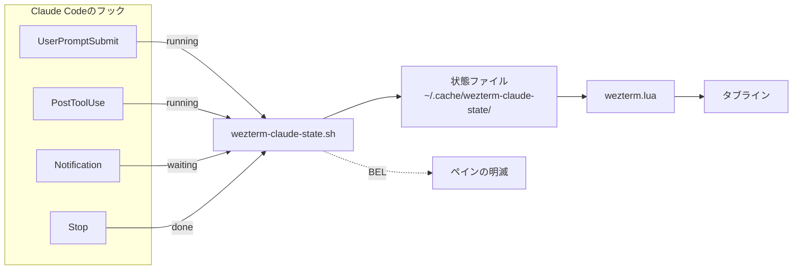

:::message
この記事は [codedchords.dev](https://codedchords.dev/blog/2026/08/claude-code-status-in-wezterm/) からの転載です。
:::

## TL;DR

- WezTerm上でMulmoTerminalのように複数のClaude Codeの状態を可視化する
- 実行中・入力待ち・完了の3状態を`tabline.wez`でタブラインにアイコン表示する
- 入力待ちやタスクが完了したペインは明滅させ、`CMD+SHIFT+J`でそのペインへジャンプできる
- 複数のClaude Codeを並行して動かしても、人間の応答待ちで止まる時間を減らせる

## はじめに

中島聡らが開発している[MulmoTerminal](https://github.com/receptron/mulmoterminal)を少し使ってみました。複数のAIエージェントをブラウザ上のターミナルに並べ、各エージェントの状態を一目で分かるようにしたツールです。私はClaude Codeしか使っていないので全体としてはピンと来ませんでしたが、この状態表示の部分だけは便利だと感じました。

そこで、私が普段使用しているWezTermの画面分割とClaude Codeで同じような通知を可能とする仕組みを作ってみました。


*タブラインに表示されたClaude Codeの状態*

WezTermのタブラインの先頭にClaude Codeのステータス表示を追加し、入力待ちやタスクが完了した場合にClaude Codeのペインが明滅するようになりました。

この仕組みを **claude-state** と名付けました。以降はこの呼び名で説明します。スクリプトやキャッシュディレクトリは `wezterm-claude-state` という名前で置いているため、本文に出てくるパスはその形になります。

## claude-stateの仕組み

claude-stateは、Claude CodeとWezTermの間に状態ファイルを1枚挟んだだけの単純な仕組みです。Claude Code側のフックが現在の状態を書き込み、WezTerm側のLuaがそれを読んでタブラインに表示します。



状態はrunning（実行中）、waiting（入力待ち）、done（完了）の3つだけで、フックが呼ばれるたびに上書きされます。セッションが終わるときは`SessionEnd`で状態ファイルごと削除します。

ファイル名にはWezTermが各ペインに割り当てる`$WEZTERM_PANE`をそのまま使います。どのペインの状態かが一意に決まるので、ペインをいくつ開いても取り違えることがありません。

ペインの明滅だけは別経路です。フックがBEL文字を書き込み、WezTermの`visual_bell`を発火させています。人がClaude Codeの後を引き継いで対応が必要な「入力待ち」と「完了」の場合のみペインが点滅します。

## 前提条件

次の環境で動かしています。以降のコードやパスはこれを前提にしています。

| 項目 | 用途と補足 |
| :--- | :--- |
| WezTerm | 20240203-110809-5046fc22で確認 |
| Claude Code | フックから状態を書き出す |
| [tabline.wez](https://github.com/michaelbrusegard/tabline.wez) | タブラインの描画に使うプラグイン |
| jq | 状態ファイルの掃除で`wezterm cli list`の出力を読む |
| OS | macOSで確認。Linux/Windowsは未検証 |
| Nerd Font（任意） | 状態を示すアイコン。絵文字でも代用可 |

私は設定ファイルをchezmoiで管理していますが、記事中のパスはすべて展開後の実ファイルのものです。

## Claude Code側の設定

フックは`~/.claude/settings.json`に登録します。5つのイベントから同じスクリプトを呼び、書き込む状態を引数で渡すだけの構成です。

```json:~/.claude/settings.json
{
  "hooks": {
    "UserPromptSubmit": [
      { "hooks": [ { "type": "command",
        "command": "[ -n \"$WEZTERM_PANE\" ] && \"$HOME/.claude/hooks/wezterm-claude-state.sh\" running prune; exit 0" } ] }
    ],
    "PostToolUse": [
      { "hooks": [ { "type": "command",
        "command": "[ -n \"$WEZTERM_PANE\" ] && \"$HOME/.claude/hooks/wezterm-claude-state.sh\" running; exit 0" } ] }
    ],
    "Notification": [
      { "hooks": [ { "type": "command",
        "command": "[ -n \"$WEZTERM_PANE\" ] && \"$HOME/.claude/hooks/wezterm-claude-state.sh\" waiting; exit 0" } ] }
    ],
    "Stop": [
      { "hooks": [ { "type": "command",
        "command": "[ -n \"$WEZTERM_PANE\" ] && \"$HOME/.claude/hooks/wezterm-claude-state.sh\" done; exit 0" } ] }
    ],
    "SessionEnd": [
      { "hooks": [ { "type": "command",
        "command": "[ -n \"$WEZTERM_PANE\" ] && \"$HOME/.claude/hooks/wezterm-claude-state.sh\" clear; exit 0" } ] }
    ]
  }
}
```

末尾を`exit 0`で閉じているのは、フックが失敗してもClaude Code本体の動作を妨げないためです。`UserPromptSubmit`にだけ付いている`prune`は、生きているペインの一覧と突き合わせて不要になった状態ファイルを削除する指示です。毎回走らせると重いので、ターンの開始時だけに限っています。

呼ばれるスクリプトの中身を見ていきます。最初に`$WEZTERM_PANE`の有無を調べ、無ければ何もせずに終了します。WezTerm以外のターミナルでClaude Codeを起動したときに、余計な副作用を出さないためです。あとはこの変数をファイル名にして状態を書き込むだけです。

```sh:~/.claude/hooks/wezterm-claude-state.sh
# WezTerm 以外のターミナルでは何もしない
[ -n "${WEZTERM_PANE:-}" ] || exit 0

dir="${XDG_CACHE_HOME:-$HOME/.cache}/wezterm-claude-state"
mkdir -p "$dir" 2>/dev/null || exit 0
file="$dir/$WEZTERM_PANE"

case "$state" in
clear | "")
 rm -f "$file"
 ;;
*)
 printf '%s' "$state" >"$file" 2>/dev/null
 ;;
esac
```

残りはペインを明滅させる部分です。WezTermの`visual_bell`はBEL文字の受信で発火するので、ペインの端末にBELを書き込みます。ここが少しだけ厄介でした。フックは制御端末を持たない子プロセスとして起動されるため、`/dev/tty`を開こうとしても`device not configured`で失敗します。

一方、Claude Code本体はペインのptyを制御端末として持っています。そこで`ps`で親プロセスを遡り、最初に見つかった端末へBELを書き込みます。直近の親はフックを起動したシェルで端末を持たないため、見つかるまで数段たどります。

```sh:~/.claude/hooks/wezterm-claude-state.sh
find_tty() {
 pid=$PPID
 i=0
 while [ "$i" -lt 6 ] && [ -n "$pid" ] && [ "$pid" != "0" ] && [ "$pid" != "1" ]; do
  set -- $(ps -o tty=,ppid= -p "$pid" 2>/dev/null)
  [ $# -ge 2 ] || return 1
  case "$1" in
  "?" | "??") ;;
  *)
   printf '/dev/%s\n' "$1"
   return 0
   ;;
  esac
  pid=$2
  i=$((i + 1))
 done
 return 1
}

# 光らせるのは人間の注意が要るときだけ
case "$state" in
waiting | done)
 dev=$(find_tty) && printf '\a' >"$dev" 2>/dev/null
 ;;
esac
```

Claude Code本体にも`preferredNotifChannel`を`terminal_bell`にすればベルを鳴らす機能がありますが、こちらは通知イベントでしか鳴りません。完了時にも光らせたかったので、フック側で鳴らすことにしました。

## WezTerm側の設定

WezTerm側がやることは、開いているペインを順に見て状態ファイルを読み、アイコンとペインIDを並べた文字列を組み立てることだけです。

```lua:~/.config/wezterm/wezterm.lua
local CLAUDE_STATE_DIR = (os.getenv("XDG_CACHE_HOME") or (os.getenv("HOME") .. "/.cache")) .. "/wezterm-claude-state"
local CLAUDE_ICON = wezterm.nerdfonts.md_robot_outline

local function read_state_file(pane_id)
 local f = io.open(CLAUDE_STATE_DIR .. "/" .. pane_id, "r")
 if not f then
  return nil
 end
 local st = f:read("*l")
 f:close()
 if st == nil or st == "" then
  return nil
 end
 return st
end

local function collect_claude_states(window)
 local icons = {
  waiting = wezterm.nerdfonts.md_bell_ring_outline,
  running = wezterm.nerdfonts.md_progress_clock,
  done = wezterm.nerdfonts.md_check_circle_outline,
 }
 local marks = {}
 for _, tab in ipairs(window:mux_window():tabs()) do
  for _, p in ipairs(tab:panes_with_info()) do
   local st = read_state_file(p.pane:pane_id())
   if st and icons[st] then
    -- グリフは幅が広く数字と詰まるので間に空白を入れる
    marks[#marks + 1] = icons[st] .. " " .. p.pane:pane_id()
   end
  end
 end
 if #marks == 0 then
  return "" -- 状態が無いときはアイコンごと消す
 end
 return " " .. CLAUDE_ICON .. " " .. table.concat(marks, " ") .. " "
end
```

読むのは開いているペインの分だけなので、Claude Codeが異常終了して残った状態ファイルは表示に出てきません。ペインIDを`p.pane:pane_id()`とメソッドで取っているのは、WezTerm 20240203では`panes_with_info()`が返す値から`pane_id`をフィールドとして取り出せず、nilになるためです。

この関数は`pcall`で包んでから登録します。例外を投げるとタブライン全体が更新されなくなるためです。

```lua:~/.config/wezterm/wezterm.lua
local function claude_states(window)
 local ok, result = pcall(collect_claude_states, window)
 if not ok then
  wezterm.log_error("claude_states: " .. tostring(result))
  return ""
 end
 return result
end

tabline.setup({
 sections = {
  tabline_x = { claude_states, "ram", "cpu" },
 },
})
```

ペインの明滅は`visual_bell`の設定です。

```lua:~/.config/wezterm/wezterm.lua
config.audible_bell = "Disabled"
config.visual_bell = {
 fade_in_duration_ms = 200,
 fade_in_function = "EaseIn",
 fade_out_duration_ms = 200,
 fade_out_function = "EaseOut",
 target = "BackgroundColor",
}
```

最後に、入力待ちのペインへ移動するキーバインドです。CMD-SHIFT-jで入力待ちのペインにジャンプできます。ペインを探す手間がなく非常に便利です。

```lua:~/.config/wezterm/wezterm.lua
table.insert(config.keys, {
 key = "j",
 mods = "CMD|SHIFT",
 action = wezterm.action_callback(function(window)
  for _, tab in ipairs(window:mux_window():tabs()) do
   for _, p in ipairs(tab:panes_with_info()) do
    if read_state_file(p.pane:pane_id()) == "waiting" then
     p.pane:activate()
     return
    end
   end
  end
 end),
})
```

## おわりに

claude-stateを入れてから、画面を見張る作業が通知を待つ作業に変わりました。Claude Codeが考えている間に別のペインへ移って手を動かせるようになったのが、一番の変化です。

MulmoTerminalは複数のエージェントを並べて動かすことを前提にしたツールなので、そこまでの使い方をするなら素直に導入した方が早いと思います。今回作ったのは、WezTerm上で「どのペインが人間のレスを待っているか」だけを知りたい、という限られた用途のものです。なお、tmuxを挟んだ場合の動作は試していません。

開発や日常の作業にClaude Codeを適用し始めると、あっという間に並行して複数のClaude Codeを稼働させる状況になります。Claude Codeを1本しか動かさないのであれば目の前の画面を見ていれば済む話ですが、それ以上に増えた瞬間から自身も効率的に作業しClaude Codeのレス待ちにタイムリーに反応していく必要があります。

これは、せっかく生成AIを使用しているのに、自分自身がボトルネックにならないための仕組みです。

## References

- [MulmoTerminal](https://github.com/receptron/mulmoterminal). "GitHub - receptron/mulmoterminal"
- [tabline.wez](https://github.com/michaelbrusegard/tabline.wez). "GitHub - michaelbrusegard/tabline.wez"
- [WezTerm](https://wezterm.org/). "Wez's Terminal Emulator"
- [Claude Code](https://docs.claude.com/en/docs/claude-code/hooks). "Hooks reference"
