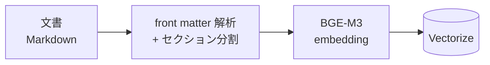
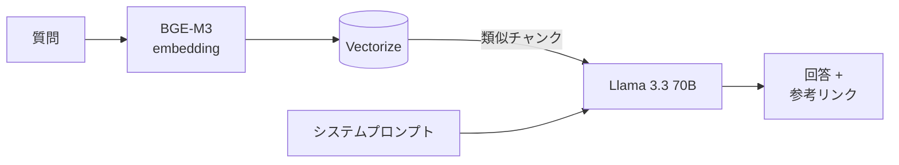

:::message
この記事は筆者の[個人ブログ](https://codedchords.dev/blog/2026/03/ask-my-digital-double/)からの転載です。元記事ではデジタル分身（bot）としてのペルソナ設定など、技術以外の側面も紹介しています。
:::

## TL;DR

同僚に私のBotが欲しいと言われたので、ちょうどCloudflare Workers AIも試したかったので真に受けて作ってみました。

- Workers AI + VectorizeだけでRAGベースのQ&Aシステムを構築
- Embedding: BGE-M3（日本語対応、1024次元）
- LLM: Llama 3.3 70B Instruct
- 差分ingestパイプラインも含めCloudflareのサービスだけで完結

たとえば、こんな質問を投げると以下のような回答が返ってきます。

> **Q:** CIOも設置せず、IT Governanceの取り組みを行なわない理事長が「生成AIを導入したい」と言っています。どうすべきですか？
>
> **A:** その理事長に、生成AIの導入が「新しいシステムの導入」と違うことを説明する必要があります。生成AIは、組織の判断の中枢に組み込まれ、自社固有の文脈で動く必要があります。そのためには、IT部門だけでなく、業務部門の理解と協力が必要です。（以下省略）

## 使用するサービス

使用するCloudflareサービスは3つだけです。

- **Workers** — アプリケーションのホスティングとAPIロジック
- **Workers AI** — Embedding生成とLLM推論
- **Vectorize** — ベクトルデータベース

フロントエンドはWorkersのAssets機能で配信しています。フレームワークは使わず、素のHTML/CSS/JSで構築しました。

## アーキテクチャ

処理フローはシンプルなRAGパターンです。

事前処理として、ナレッジとなる文書をVectorizeに投入しておきます。



質問時は、入力をベクトル化して類似チャンクを検索し、コンテキストと合わせてLLMに渡します。



処理の流れは以下の通りです。

1. ユーザーが質問を入力
2. WorkersがBGE-M3で質問をベクトル化
3. Vectorizeで類似チャンクを検索（上位5件、スコア閾値0.3）
4. システムプロンプト＋取得したチャンク＋質問をLlama 3.3 70Bに渡す
5. 回答テキスト＋参考リンクをフロントエンドに返す

## Workers AI のバインディング

Workers AIの最大の特徴は `env.AI.run()` というバインディング呼び出しです。APIキーの管理もSDKのインストールも不要で、`wrangler.toml` に以下を書くだけで使えます。

```toml
[ai]
binding = "AI"
```

外部APIを叩いている感覚がなく、Workersの中でAIを呼んでいるだけという体験は新鮮です。

## モデル選定

- Embedding: BGE-M3
  - EmbeddingモデルはBGE-M3（`@cf/baai/bge-m3`）を採用。BAAI開発の多言語対応モデルで、出力は1024次元。日本語と英語が混在する文書に対応できることが決め手だった。当初はPLaMo-Embedding-1Bを検討したが、出力が2048次元でVectorizeの上限（1536次元）を超えるため断念している。
- LLM: Llama 3.3 70B
  - LLMはLlama 3.3 70B Instruct FP8 Fast（`@cf/meta/llama-3.3-70b-instruct-fp8-fast`）。128Kトークンのコンテキストウィンドウを持ち、日本語での回答生成は概ね良好。既知の問題として中国語文字の混入があるが、システムプロンプトで「日本語で回答すること」を明示することで抑制している(完全にはできていない)。

## ナレッジベースの構築（Ingest パイプライン）

文書をVectorizeに投入するスクリプト（ingest）の処理は以下の通りです。

1. 文書のfront matterからslug、title、date、tagsを抽出
2. 本文を見出し（`##`）単位でセクション分割
3. 各チャンクにメタデータ（slug、title、section、URL）を付与
4. BGE-M3でベクトル化してVectorizeにアップサート

差分検出にはマニフェストファイル（slug → MD5ハッシュのマッピング）を使い、変更のあった文書のみ再処理します。

Vectorizeのメタデータ上限は10,240 bytesです。チャンク本文をメタデータに格納する場合、この上限に注意が必要です。今回は8,000 bytesに切り詰めています。

## RAG の実装

Embedding生成からVectorize検索まで、処理はシンプルです。BGE-M3で質問をベクトル化し、Vectorizeで類似チャンクを検索します。上位5件を取得し、スコア閾値でフィルタリングしています。各チャンクに付与されたメタデータを使って、回答時の参考記事へのURL生成も可能です。

LLMの呼び出しも同じパターンです。`env.AI.run()` にモデル名とメッセージを渡すだけで回答が返ってきます。

```typescript
const llmResult = await env.AI.run("@cf/meta/llama-3.3-70b-instruct-fp8-fast", {
  messages: [
    { role: "system", content: systemPrompt },
    { role: "user", content: question },
  ],
  max_tokens: 512,
});

const answer =
  (llmResult as { response?: string }).response ||
  "回答を生成できませんでした。";
```

## コスト

Workers AIの無料枠は10,000 Neurons/日です。個人プロジェクトの規模（1日数件の質問）であれば十分収まります。

超過した場合はWorkers Paidプラン（月 $5）で $0.011/1,000 Neuronsの従量課金です。月数ドル程度の見込みです。悪用防止のため、KVベースでIPあたり60秒間10リクエストのレート制限を設けています。

## 課題と改善点

- BGE-M3の日本語検索精度の検証（チャンクサイズの最適値を探る必要がある）
- KVキャッシュによる同一質問の重複推論回避
- LLMのmax_tokens最適値（回答品質とコストのバランス）

## まとめ

Cloudflare Workers AI + VectorizeによるRAG構築は、想像以上に手軽でした。`env.AI.run()` のバインディングによりAPIキー管理が不要で、EmbeddingからLLM推論まで同じインターフェースで呼び出せます。

無料枠が十分にあるため、個人プロジェクトでRAGを試してみたい方にはおすすめの選択肢です。
