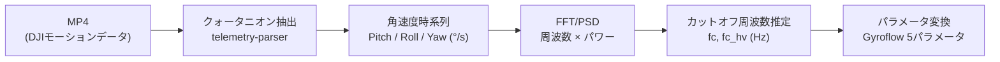

## TL;DR

DJIドローンの映像ファイルに埋め込まれた機体の動きデータを元に、映像のブレを後処理で除去するGyroflow[^gyroflow]の調整パラメータ5種を信号処理のみで自動推定するアルゴリズムをRustで作ってみた。手動調整の出発点として使う想定。

https://github.com/yostos/gyrotriage


[^gyroflow]: [Gyroflow](https://gyroflow.xyz/)はカメラのジャイロデータを使って映像を安定化するオープンソースのツールで、ドローン撮影コミュニティで広く使われている。

## はじめに

私はドローンを2機運用しています。空撮用のDJI Air 3Sは3軸メカニカルジンバル（チルト・ロール・パン）を搭載しており、物理的にカメラを安定させるため映像のブレはほとんど問題になりません。一方、小型のDJI Neoは1軸ジンバル（チルトのみ）しか搭載しておらず、ロール方向やヨー方向の振動は機械的に吸収できないため、その撮影動画はブレブレになります。

いずれの機体にも電子手ブレ補正（Electronic Image Stabilization、以降はEIS）が搭載されていますが、リアルタイムで行なうEISの品質には限界があります。

- FOV（画角）が狭くなる — クロップによる安定化のため
- ジェロ（こんにゃく現象）— モーター振動との干渉で映像が波打つ
- 100fps以上の高フレームレート撮影では使用不可

そこで一般的にEISをオフにして撮影し、Gyroflowで後処理が行われます。DJIの機体はEISオフの状態で撮影するとモーションデータ（クォータニオン姿勢データ）をMP4に埋め込むため、これをGyroflowに渡してポストプロダクションで安定化できます。

## 難解なGyroflowのパラメータ

Gyroflowは非常に優秀なブレ軽減アプリです。しかし、Gyroflowには複数の調整パラメータがあり、クリップごとに手動で試行錯誤するのは手間がかかります。

主要なパラメータは以下の5つです。

| パラメータ                          | 意味                                                                     |
| ----------------------------------- | ------------------------------------------------------------------------ |
| Smoothness (%)                      | スムージングの基本強度（UI上の%表示、内部値は0.01–0.50に対応）。高いほどブレを強く除去するが、意図した動きも鈍る |
| Max smoothness (s)                  | スムージングの時定数上限。突発的なブレに対する最大補正量を決める         |
| Max smoothness at high velocity (s) | 高速旋回時の時定数上限。短くすることで旋回への追従性を保つ               |
| Zoom limit (%)                      | 安定化で生じる黒縁を隠すためのズーム上限                                 |
| Zooming speed (s)                   | Dynamic zoomingのFOV遷移速度。ブレの変動に応じたズームの追従速度         |

いずれも強く設定すればブレは消えますが、意図したカメラワークまで平滑化されたり、クロップで解像度が落ちたりします。適切な値は映像ごとに異なるため、これまでは適当な値から始めて試行錯誤で設定していました。

MP4に埋め込まれたモーションデータからブレと意図した挙動を区別しいい感じのパラメータを算出できるのではないかと考えました。本記事で解説するアルゴリズムの全体像は以下の通りです。



## DJI MP4に埋め込まれたモーションデータ

DJIドローンのMP4に埋め込まれたモーションデータには、カメラの姿勢を表すクォータニオン時系列が含まれています[^recording-conditions]。サンプリングレートは約2000Hzです。DJIの機体は生のIMUデータではなく、機体側で算出済みのクォータニオンを記録しています。

このデータの抽出には`telemetry-parser`クレートを使用しています。

```rust
use telemetry_parser::tags_impl::{GetWithType, GroupId, TagId, TimeQuaternion};
use telemetry_parser::Input;

let input = Input::from_stream(&mut file, filesize, path, |_| {}, cancel_flag)?;

for sample in &samples {
    if let Some(ref tag_map) = sample.tag_map {
        if let Some(quat_group) = tag_map.get(&GroupId::Quaternion) {
            if let Some(quats) =
                GetWithType::<Vec<TimeQuaternion<f64>>>::get_t(quat_group, TagId::Data)
            {
                all_quaternions.extend_from_slice(quats);
            }
        }
    }
}
```

[^recording-conditions]: モーションデータが記録される条件は機種ごとに限定されています。DJI Avata/Avata 2はEIS（Rocksteady）オフかつFOV Wide、DJI Neo/Neo2はアスペクト比4:3（EISは自動的にオフ）が必要。16:9での撮影やEIS有効時にはモーションデータが記録されない。

## クォータニオンから角速度への変換

クォータニオンは「ある瞬間の姿勢」を表すデータであり、ブレの大きさや速さを直接示すものではありません。ブレを定量化するには、連続するフレーム間で姿勢がどれだけ速く変化したか、すなわち角速度（°/s）の時系列に変換する必要があります。

:::message
**用語解説**
**クォータニオン**は3次元の回転を4つの数値 `(w, x, y, z)` で表現する方法です。オイラー角と比べてジンバルロック（特定の角度で自由度が縮退する現象）がなく、回転の合成が効率的なため、航空・宇宙分野やゲームエンジンで広く使われています。
**オイラー角**は回転をPitch（上下）・Roll（左右の傾き）・Yaw（水平回転）の3軸で表現する方法で、人間にとって直感的です。
**差分回転**は連続する2つの姿勢 q₁, q₂ の相対回転で、`q_diff = conj(q₁) × q₂` で求めます。これをオイラー角に分解すると、サンプル間のPitch/Roll/Yaw変化量が得られます。
:::

変換の手順は以下の通りです。

1. 連続する2つのクォータニオンq₁, q₂ から差分回転q_diffを計算する
2. q_diffをオイラー角に分解してPitch/Roll/Yawの角変位を得る
3. 角変位をサンプル間の時間差 Δtで割って角速度に変換する

```rust
// 差分回転の計算: q_diff = conj(q1) × q2
let q_diff = quat_mul(&conjugate(q1), q2);

// オイラー角への分解
let pitch = (2.0 * (w * x + y * z)).atan2(1.0 - 2.0 * (x * x + y * y));
let sinp = 2.0 * (w * y - z * x);
let roll = if sinp.abs() >= 1.0 {
    FRAC_PI_2.copysign(sinp)
} else {
    sinp.asin()
};
let yaw = (2.0 * (w * z + x * y)).atan2(1.0 - 2.0 * (y * y + z * z));

// 角変位(rad) → 角速度(°/s)
pitch_velocities.push(pitch.to_degrees().abs() / dt);
roll_velocities.push(roll.to_degrees().abs() / dt);
yaw_velocities.push(yaw.to_degrees().abs() / dt);
```

これにより2000Hzのクォータニオン時系列から3軸の角速度時系列が得られます[^abs-note]。30秒のクリップで約60,000サンプルです。

[^abs-note]: 各軸の角速度は絶対値を取っているため、PSD上では偽の高調波が生じうる。ただしパラメータ推定ではPSDの相対的な形状（谷の位置やパワー比）のみを使用しており、実用上の影響はない。

## PSDによる周波数解析

前のセクションで得られた角速度時系列には、パイロットが意図したカメラワーク（パン・チルト・旋回）と、除去したいブレ（風、機体振動、モーター振動）が混在しています。Gyroflowのパラメータを決めるには、この2つを区別する必要があります。

ここで使うのがFFT/PSD（パワースペクトル密度）解析です。FFT（高速フーリエ変換）は時系列信号を周波数成分に分解する手法で、PSDは各周波数にどれだけのパワー（エネルギー）が含まれるかを示します。意図した動きとブレは周波数帯域が異なるため、PSDで両者を客観的に分離できます。典型的な帯域の目安は以下の通りです。

| 帯域         | 周波数   | 発生源             |
| ------------ | -------- | ------------------ |
| 意図した動き | < 1 Hz   | パン・チルト・旋回 |
| 風・機体振動 | 3–10 Hz  | 機体の姿勢変動     |
| モーター振動 | 20–80 Hz | プロペラ回転       |

たとえば、パイロットがゆっくりパンする動きは1Hz以下の低周波に現れ、プロペラの振動は20Hz以上の高周波に現れます。PSDでこの境界を見つければ、「どこまでが残すべき動きで、どこからが除去すべきブレか」を定量的に判定できます。

### PSD計算の手順

1. 3軸の角速度を合成する（RSS: Root Sum Square）
2. 窓関数（Hann窓）を適用する — FFTは入力信号を周期的と仮定するため、有限長の信号をそのまま渡すと両端の不連続から本来存在しない周波数成分が漏れ出す（スペクトルリーケージ）。Hann窓は信号の両端をなめらかにゼロへ近づけてこれを抑制する
3. FFTを実行する
4. 片側PSDを計算する — FFTの出力は正負両方の周波数を含むが、実数信号では負の周波数は正の鏡像なので、正の周波数側だけを取り出してパワーを2倍にする

:::details compute_psdの実装（Rust）
```rust
fn compute_psd(signal: &[f64], sample_rate_hz: f64) -> (Vec<f64>, Vec<f64>) {
    let n = signal.len();

    // Hann窓の適用
    let mut buffer: Vec<Complex<f64>> = signal
        .iter()
        .enumerate()
        .map(|(i, &v)| {
            let window =
                0.5 * (1.0 - (2.0 * PI * i as f64 / n as f64).cos());
            Complex::new(v * window, 0.0)
        })
        .collect();

    // FFT実行
    let mut planner = FftPlanner::new();
    let fft = planner.plan_fft_forward(n);
    fft.process(&mut buffer);

    // 片側PSD: |X[k]|² / (N × fs) × 2
    let n_freqs = n / 2 + 1;
    let df = sample_rate_hz / n as f64;
    let norm = 1.0 / (n as f64 * sample_rate_hz);

    let frequencies: Vec<f64> = (0..n_freqs).map(|i| i as f64 * df).collect();
    let psd: Vec<f64> = (0..n_freqs)
        .map(|i| {
            let mag_sq = buffer[i].norm_sqr();
            let factor = if i == 0 || i == n_freqs - 1 { 1.0 } else { 2.0 };
            mag_sq * norm * factor
        })
        .collect();

    (frequencies, psd)
}
```
:::

## カットオフ周波数の推定

PSDから2種類のカットオフ周波数を推定します。

**主カットオフ周波数 fc** は、意図した動きとブレの境界です。0.5–5 Hzの範囲でPSD（移動平均で平滑化済み）の最小値を探索して求めます。パワーの最も小さい周波数が、低周波の意図した動きと高周波のブレ/振動の境界に相当します。

:::details find_shake_band_cutoffの実装（Rust）
```rust
fn find_shake_band_cutoff(
    frequencies: &[f64], psd: &[f64], min_shake_hz: f64,
) -> f64 {
    let df = frequencies[1] - frequencies[0];

    // 0.5Hz幅の移動平均でPSDを平滑化
    let window = (0.5 / df).max(1.0) as usize;
    let smoothed = smooth_psd(psd, window);

    // 0.5–5 Hzの範囲で谷（極小値）を探索
    let search_low = (0.5 / df) as usize;
    let search_high = ((5.0 / df) as usize).min(smoothed.len());

    let mut min_idx = search_low;
    let mut min_val = f64::MAX;
    for (i, &val) in smoothed.iter().enumerate()
        .skip(search_low).take(search_high - search_low)
    {
        if val < min_val {
            min_val = val;
            min_idx = i;
        }
    }
    frequencies[min_idx].max(0.3) // 最小0.3 Hz
}
```
:::

ローパスフィルタのカットオフは「残すべき信号と除去すべき信号の境界」に置く必要があり、PSDの谷はまさにこの境界を示しています。

**高速回転カットオフ fc_hv** は、FPVの高速旋回時に使用する上限周波数です。累積パワーの80%点と `fc × 2` の大きい方を採用し、10 Hz以下にクランプします。高速旋回中は低周波の意図した動きが支配的になるため、通常より高い周波数まで通過させる必要があります。

## カットオフ周波数からGyroflowパラメータへの変換

カットオフ周波数が得られたら、Gyroflowの5つのパラメータに変換します。変換の核となるのは、カットオフ周波数からローパスフィルタの時定数への変換です。

```
τ = 1 / (2π × fc)
```

この式はGyroflowの内部実装に由来します[^gyroflow-version]。Gyroflowのスムージングは指数平滑フィルタ（EMA）を使用しており、そのフィルタ係数は以下の式で計算されています。

```
alpha = 1 - exp(-(1 / sample_rate) / smoothness)
```

ここで`smoothness`がτに相当します。カットオフ周波数fcとτの関係 `τ = 1/(2πfc)` は、一次RCローパスフィルタの理論からの導出です。

以下に5つのパラメータの算出ロジックを示します。

| パラメータ                          | 算出方法                               | 出力範囲  |
| ----------------------------------- | -------------------------------------- | --------- |
| Smoothness (%)                      | shake power ratio + RMS角速度から決定  | 15–50%    |
| Max smoothness (s)                  | 主カットオフ fc → 時定数 τ             | 0.3–2.0s  |
| Max smoothness at high velocity (s) | 高速回転カットオフ fc_hv → 時定数 τ_hv | 0.03–0.3s |
| Zoom limit (%)                      | Smoothness + RMS角速度から推定         | 105–140%  |
| Zooming speed (s)                   | ローリングRMSの変動係数（CV）から決定  | 2.0–6.0s  |

:::message
**用語解説**
**RMS（Root Mean Square、二乗平均平方根）** は、信号の大きさを表す統計量です。各値を二乗して平均を取り、その平方根を返します。正負が打ち消し合う角速度のような信号でも、振れ幅の大きさを正しく評価できます。
**変動係数（CV: Coefficient of Variation）** は、標準偏差を平均で割った値（CV = σ / μ）です。平均の大きさに依存しない「ばらつき度合い」の指標で、時系列の均一さを定量化するのに使います。
:::

以下では、アルゴリズムの特徴が異なるSmoothnessとZooming speedを詳しく解説します。Max smoothness / Max smoothness at high velocityはカットオフ周波数から時定数τを算出してクランプするだけであり、Zoom limitはSmoothnessとRMS角速度の線形変換です。詳細は[リポジトリ](https://github.com/yostos/gyrotriage)を参照してください。

## Smoothness — ブレ占有率からの決定

Smoothnessはスタビライゼーションの基本的な強度を決めるパラメータです。PSDから算出したshake power ratio（カットオフ周波数以上のパワーが全体に占める割合）とRMS角速度から決定します。

```rust
fn smoothness_from_spectrum(
    spectrum: &SpectrumResult, rms_velocity: f64,
) -> f64 {
    // shake power ratio: 0（全て意図した動き）〜1（全てブレ）
    let base = 15.0 + 35.0 * spectrum.shake_power_ratio;

    // RMS角速度による補正
    let velocity_factor = if rms_velocity < 3.0 {
        0.85 // 動きが少ない → 弱めで十分
    } else if rms_velocity > 15.0 {
        1.15 // 動きが大きい → 強めが効果的
    } else {
        0.85 + 0.30 * (rms_velocity - 3.0) / 12.0
    };

    (base * velocity_factor).clamp(15.0, 50.0)
}
```

shake power ratioが0なら信号は全て意図した動きなので最低限のスムージング（15%）で十分です。1なら全てブレなので最大（50%）のスムージングが必要です。FPVの典型的なフライトデータではshake power ratioが0.15–0.60の範囲に収まり、Smoothnessは20–35%になります。これは筆者がFPVフライトで試した範囲では妥当な値でした。

## Zooming speed — 時間的変動性の定量化

Zooming speedはDynamic zoomingのFOV遷移速度を制御するパラメータです。これだけは周波数ではなく、角速度の時間的な変動パターンから決定します。

:::details estimate_zooming_speedの実装（Rust）
```rust
fn estimate_zooming_speed(
    pitch: &[f64], roll: &[f64], yaw: &[f64], sample_rate_hz: f64,
) -> f64 {
    // 3軸合成角速度の大きさを計算
    let composite: Vec<f64> = pitch.iter()
        .zip(roll.iter()).zip(yaw.iter())
        .map(|((&p, &r), &y)| (p * p + r * r + y * y).sqrt())
        .collect();

    // 1秒窓のローリングRMS（50%オーバーラップ）
    let window_size = sample_rate_hz as usize;
    let step = window_size / 2;
    let mut window_rms_values: Vec<f64> = Vec::new();
    let mut start = 0;
    while start + window_size <= composite.len() {
        let window = &composite[start..start + window_size];
        let sum_sq: f64 = window.iter().map(|v| v * v).sum();
        window_rms_values.push((sum_sq / window.len() as f64).sqrt());
        start += step;
    }

    // 変動係数 CV = σ / μ
    let mean: f64 =
        window_rms_values.iter().sum::<f64>() / window_rms_values.len() as f64;
    let variance: f64 = window_rms_values.iter()
        .map(|v| (v - mean).powi(2)).sum::<f64>()
        / window_rms_values.len() as f64;
    let cv = variance.sqrt() / mean;

    // CV → zooming speed へのマッピング
    (6.0 - 4.0 * cv.min(1.0)).clamp(2.0, 6.0)
}
```
:::

変動係数（CV）を使う理由は、ブレの時間的な不均一さを定量化するためです。

- CV ≈ 0（均一なブレ）→ 6.0s（ゆっくりしたFOV遷移で十分）
- CV ≈ 0.5（中程度の変動）→ 4.0s（Gyroflowデフォルト相当）
- CV ≈ 1.0以上（間欠的ブレ）→ 2.0s（素早いFOV追従が必要）

ブレが間欠的に発生するフライト（アクロバット中に静止区間が挟まるケース）では、FOVを素早く追従させないとズームの過不足が生じます。一方、ブレの均一なフライトでは、ゆっくりしたFOV遷移の方が映像は自然に見えます。

## CLIの出力

ここまで解説したアルゴリズムをRustのCLIツールとして実装しました。MP4ファイルを渡すと、ブレのスコアリングと推定パラメータをテキストで出力します。

```
File:        DJI_20260228080801_0003_D.MP4
Duration:    30.3s (60593 samples @ 2000Hz)
Score:       100 / 100
Level:       SEVERE
RMS:         34.8 °/s
Peak:        644.0 °/s
Pitch:       avg=1.4°/s  std=2.2°/s  max=47.9°/s
Roll:        avg=11.7°/s  std=13.5°/s  max=251.1°/s
Yaw:         avg=3.3°/s  std=4.4°/s  max=89.0°/s
---
Gyroflow:    smoothness=21%  max=0.300s  max@hv=0.030s
             zoom_limit=118%  zooming_speed=2.6s
```

ただし、数値だけではそのクリップのブレ特性が直感的にわかりません。Gyroflowを掛ける前にブレの大きさや軸ごとの偏りを視覚的に把握し、推定パラメータの妥当性を確認できると便利です。そこで解析結果をHUD風にグラフィカルに表示する機能を設けました（冒頭の画像）。`plotters`クレートで1440×900のPNG画像を生成しています。

HUD画面にはスコアゲージ、レーダーチャート（3軸比較）、4本のライングラフ（Composite/Pitch/Roll/Yaw）、推定パラメータが表示されます。CLIツールなのでターミナル上に表示する必要がありますが、Sixel/iTerm2プロトコルに対応したターミナル（WezTerm、iTerm2等）ではインライン表示し、非対応環境ではPNGファイルとして出力します。テキストのみの環境向けには、Unicodeブロック文字（▁▂▃▄▅▆▇█）を使ったANSIスパークラインも用意しています。

## 制約と注意事項

このアルゴリズムにはいくつかの制約があります。

- 対応機体はクォータニオン姿勢データをMP4へ埋め込むDJI機種に限定される（他社製ドローンやDJIの旧機種には非対応）
- 推定値は信号処理に基づく客観的な算出であり、映像の主観的な品質評価は含まない
- パン・チルト等の意図した動きとブレの区別は周波数帯域の分離に依存しており、非常にゆっくりしたブレ（<0.3Hz）は意図した動きと区別できない
- Gyroflowの「Default」アルゴリズムを前提としている。「Plain 3D」や軸別（Per-axis）モードでは推定値の解釈が異なる
- 極端に短いクリップ（2秒未満）では周波数分解能が不足し、推定精度が低下する

推定値はあくまでパラメータ調整の出発点（ベースライン）であり、映像品質を保証するものではありません。最終的にはGyroflowのプレビューで映像を確認しながら微調整することを想定しています。商用空撮等の業務用途では、必ずプレビューで結果を検証してください。

## 実際の効果

以下は、このアルゴリズムで推定したパラメータを微調整なしでそのままGyroflowに適用した映像（右）と、オリジナルの未処理映像（左）の比較です。

@[youtube](uEInUgQIBrs)

## まとめ

核となるアイデアは、ドローンの角速度信号において「意図した動き」と「ブレ」が異なる周波数帯域に分布するという性質の活用です。PSDの最小値をカットオフ周波数として検出し、そこからGyroflowの時定数に変換することで、主観的な判断やトレーニングデータなしにパラメータを推定できることを示しました。

実装はRustで行い、`telemetry-parser`（MP4解析）、`rustfft`（FFT計算）、`plotters`（可視化）という構成です。信号処理の基本的な手法の組み合わせで実用的な結果が得られたのは、DJIが高精度なクォータニオンデータを2000Hzで記録しているおかげでもあります。

[^gyroflow-version]: 本記事のEMA式はGyroflow v1.6.3時点の「Default」アルゴリズム（[src/core/smoothing/default_algo.rs](https://github.com/gyroflow/gyroflow/blob/master/src/core/smoothing/default_algo.rs)）の実装に基づく。将来のバージョンで内部実装が変更されると、推定値の妥当性も変わる可能性がある。
