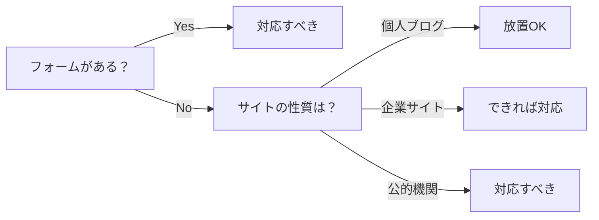

私は個人ブログをZola+GitHub Pagesで運用しています。GitHub Pagesはセキュリティヘッダの設定ができません。セキュリティスキャナーで未設定の警告が出ると、対応すべきか悩むこともあるでしょう。対応すべきか放置すべきかの判断基準を解説しておきます。

## TL;DR

- GitHub Pagesではセキュリティヘッダーを設定する機能がなく、スキャナーの警告がでる
- セキュリティスキャナーの警告は「ベストプラクティス未達」であり「脆弱性」ではない
- GitHub Pagesでは大抵静的サイトのため、放置しても実質的なリスクは低い
- 自前でホスティングしたWordPressなどの動的サイトは必ず対応すべき

## セキュリティヘッダーとは何か

セキュリティスキャナーでよく指摘される6つのHTTPレスポンスヘッダーがあります。

| ヘッダー                         | 目的                     | 設定しないリスク           |
| -------------------------------- | ------------------------ | -------------------------- |
| Strict-Transport-Security (HSTS) | HTTPS接続を強制          | HTTPへのダウングレード攻撃 |
| Content-Security-Policy (CSP)    | XSS攻撃を防止            | 悪意あるスクリプト実行     |
| X-Frame-Options                  | クリックジャッキング防止 | 偽サイトへの埋め込み       |
| X-Content-Type-Options           | MIMEスニッフィング防止   | ファイル種別の誤認識       |
| Referrer-Policy                  | リファラー情報の制御     | URLパラメータの漏洩        |
| Permissions-Policy               | ブラウザ機能の制御       | カメラ等の不正利用         |

これらのヘッダーは、Webサーバーがレスポンスに含めることで、ブラウザにセキュリティ関連の指示を与えます。

## GitHub Pagesの制限

GitHub Pagesは静的サイトホスティングサービスですが、**HTTPレスポンスヘッダーをカスタマイズする機能がありません**。

- `.htaccess` は使えない（Apache設定ファイル）
- `nginx.conf` も使えない（Nginx設定ファイル）
- GitHub側で固定されたヘッダーが返される

どうしてもセキュリティヘッダーを設定したい場合は、Cloudflare CDNを前段に置けばTransform Rulesでヘッダーを追加できます。ただし、Cloudflareの無料プランはネームサーバー移管が必須です。

既存のDNSサービスを使い続けたい場合、この方法は採用しづらいです。

## 静的サイトと動的サイトでリスクが違う

セキュリティヘッダーの重要度は、サイトの種類によって大きく異なります。GitHub Pagesでも動的なSPAをホストできますが、ここではZolaやHugoなどのSSGで生成した純粋な静的サイトを想定しています。

| 観点                 | 静的サイト（SSG生成） | 動的サイト（WordPress等） |
| -------------------- | --------------------- | ------------------------- |
| ユーザー入力         | 受け付けない          | フォーム等で受け付ける    |
| サーバーサイド処理   | なし                  | PHP + DB                  |
| 管理画面             | なし                  | `/wp-admin` 等が存在      |
| XSSリスク            | ほぼなし              | 高い                      |
| クリックジャッキング | 影響軽微              | 管理画面が標的になる      |

WordPressでセキュリティヘッダーが未設定の場合、管理者がログイン中にクリックジャッキング攻撃を受けたり、XSS経由でマルウェアを注入されたりするリスクがあります。

## 判断基準：いつ対応すべきか

以下のフローチャートで判断できます。

フォームがあるサイトは対応が必要です。問い合わせフォーム、会員登録、ログイン機能、寄付やEC機能があれば、ユーザー入力を受け付けるためXSSのリスクがあります。

フォームがない場合はサイトの性質で判断します。個人の技術ブログやポートフォリオなら放置で問題ありません。公的機関などのサイトは、信頼性の観点から対応が望ましいです。

## まとめ

セキュリティスキャナーの警告を見ると焦りますが、すべての警告に対応する必要はありません。

**重要なのはリスク評価です。**

- 何を守る必要があるか（資産）
- どんな攻撃が想定されるか（脅威）
- 攻撃が成功する可能性はあるか（脆弱性）

GitHub Pagesで静的ブログを公開している場合、セキュリティヘッダーがなくても攻撃面がほとんどありません。「設定できないから放置」は、この場合は合理的な判断です。

一方、WordPressや動的サイトでは事情が異なります。`.htaccess` やプラグインで設定できるので、対応しておくべきです。

スキャナーの警告は「ベストプラクティスに従っていない」という指摘であり、「今すぐ危険」という意味ではありません。コンテキストに応じた判断をしましょう。

## 参考文献

- [OWASP Secure Headers Project](https://owasp.org/www-project-secure-headers/)
- [GitHub Community Discussion - HTTP Headers on Pages](https://github.com/orgs/community/discussions/54257)

---

:::message
本記事は情報提供を目的としており、個別の状況に応じた判断は読者ご自身の責任でお願いします。セキュリティ要件は組織やサービスによって異なるため、必要に応じて専門家にご相談ください。
:::
