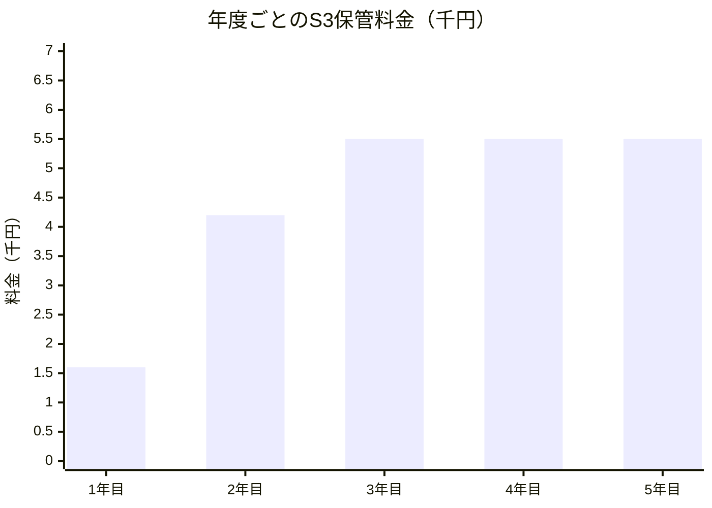

:::message
この記事は [codedchords.dev](https://codedchords.dev/blog/2026/04/rclone/) からの転載です。
:::

## TL;DR

ほとんど触らないが消したくない個人データの「眠らせ場所」を、rcloneとAmazon S3で構築した記録です。

- 細い上り回線でも止まらないよう、rcloneの並列度・チャンクサイズ・リトライをチューニング
- S3ライフサイクルでGlacier Deep Archiveへ自動降格させる構成。降格・削除の期間はデータの再アクセス特性から逆算して決めるのが肝要
- IAM最小権限・マルチパート残骸クリーンアップ・Deep Archive最低保管期間180日など運用上のハマりどころも整理
- 月額数百円のレンジで運用できるコスト試算を提示
- 認証情報を平文で残さないため、1Password CLI (`op run`) で実行時に環境変数として注入する構成も併記（2026-05-05追記）

## はじめに

ドローンで撮りためた動画素材がNASの容量を圧迫してきたので、編集後はほとんど触らないものをAmazon S3に退避させる仕組みを作りました。手元から外しはするものの、まとめ直しのときに見返す可能性は残しておきたい、いわばコールドアーカイブの個人運用版です。

自宅はHome 5Gで上りが20〜30Mbpsと細いため、転送には `rclone` を使い、回線が太い場所にいるかどうかでパラメータを切り替えながらアップロードしています。さらに保管側はS3のライフサイクルで自動的にGlacier Deep Archiveに降格させ、月額数百円のレンジで運用できるようにしています。

本記事では、この「転送のチューニング」と「保管の自動化」の二段構えを、AWS側の設定からrcloneのオプション、最後にコスト試算まで通しでまとめます。

## なぜAmazon S3を選んだか

「眠らせておく置き場」に求める要件はおおむね以下のとおりです。

- 編集後はほとんどアクセスしないが、過去作をまとめ直すときに見返すことはある
- 手元のストレージやNASから退避させたい、しかし消したくはない
- 容量が増えても料金がじわじわ膨らまないこと
- 保管・削除の運用を手動でやらずに済むこと

クラウド側の候補としてはDropboxやBoxのようなサブスクリプション型ストレージも挙がりましたが、構造的な違いから最終的にAmazon S3を選びました。観点ごとの違いをまとめると以下のとおりです。

| 観点 | サブスクリプション型 | Amazon S3 |
|---|---|---|
| 料金構造 | 容量プラン単位の月額固定で、使っていない分にも払い続ける | 置いた分・使った分の従量課金。数百GBの素材保管なら割安 |
| ストレージクラス | 内部的にHotストレージのみで、アクセス頻度の低いファイルでも単価は変わらない | Standard / Standard-IA / Glacier / Glacier Deep Archiveの複数階層。Deep ArchiveはStandardより一桁安い |
| 運用の自動化 | ファイルの整理・移動・削除を手動で実施 | ライフサイクルで「3日後にDeep Archiveへ降格、2年後に削除」のように宣言的に管理 |

ひとつだけ運用上の注意点があります。S3にアップロード後すぐにNASから消してしまうと、S3が事実上の唯一コピーになります。バックアップの基本である3-2-1ルール（コピー3、媒体2、オフサイト1）の観点では、編集が完全に終わった素材であっても、NAS側を一定期間（例: 半年〜1年）残しておくと安全側に倒せます。私はNASの容量に余裕がある間は最近のフライトを残し、容量を圧迫してきたら古いものから順にNAS側を整理する運用にしています。

## rcloneとは

S3へのアップロードツールとしては `rclone` を使用しています。

`rclone` は70以上のクラウドストレージに対応する汎用ファイル転送ツールです。S3・Google Drive・Dropbox・OneDrive・SFTP・WebDAVなどを統一的なコマンドで扱えます。rsyncのクラウド版というのが一番近い説明です。

これまではMacのGUIアプリ [Transmit](https://panic.com/transmit/) や、コマンドラインの `s3cmd` を使っていました。日常的なファイル転送ではどちらも十分でしたが、今回のように回線が細く中断も起こり得る環境で大量にアップロードする用途では、`rclone` のほうが明確に向いていました。観点ごとの違いをまとめると以下のとおりです。

| 観点 | Transmit / s3cmd | rclone |
|---|---|---|
| 転送のチューニング | TransmitはGUIで直感的だが並列度・チャンクサイズの細かい調整は不可。`s3cmd` もマルチスレッドや帯域制御は限定的 | 並列度・チャンクサイズ・帯域上限・リトライまで細かく指定でき、細い回線でもスループットを引き出せる |
| 不安定な回線への耐性 | 中断・再開を強くは支援しない | ETag比較で同一ファイルの再転送をスキップでき、リトライも「ジョブ全体」と「個別HTTPリクエスト」の2階層で設定可能 |
| 対応バックエンドの広さ | `s3cmd` は名前のとおりS3専用、TransmitはGUI対応サービスのみ | S3以外にも多数のクラウドに同じインターフェースで対応 |

## IAMユーザーの権限設定

最初にAWS側で必要な準備を済ませておきます。具体的には、転送に使うIAMユーザーの権限と、保管ルールを定義するS3のライフサイクル設定の2点です。まずIAMから設定します。

S3バケットへのアクセス権を持つIAMユーザーを作成し、アクセスキーを発行します。ルートアカウントのキーは絶対に使わないでください。最小権限のIAMポリシー例は以下のとおりです（バケット名を `video-backup` とする場合）。

```json:iam-policy.json
{
  "Version": "2012-10-17",
  "Statement": [
    {
      "Effect": "Allow",
      "Action": ["s3:ListBucket", "s3:GetBucketLocation"],
      "Resource": "arn:aws:s3:::video-backup"
    },
    {
      "Effect": "Allow",
      "Action": [
        "s3:PutObject",
        "s3:GetObject",
        "s3:DeleteObject",
        "s3:AbortMultipartUpload",
        "s3:ListMultipartUploadParts"
      ],
      "Resource": "arn:aws:s3:::video-backup/*"
    }
  ]
}
```

`s3:AbortMultipartUpload` はマルチパートアップロード失敗時のクリーンアップに必要です。これがないと中断したアップロードの残骸が課金対象として残り続けてしまいます。

ここまでの内容をAWS CLIで適用する手順は以下のとおりです。

```bash
# IAM ユーザーを作成
aws iam create-user --user-name rclone-backup

# 上記の iam-policy.json からポリシーを作成
aws iam create-policy \
  --policy-name VideoBackupPolicy \
  --policy-document file://iam-policy.json

# ユーザーにポリシーをアタッチ
ACCOUNT_ID=$(aws sts get-caller-identity --query Account --output text)
aws iam attach-user-policy \
  --user-name rclone-backup \
  --policy-arn arn:aws:iam::${ACCOUNT_ID}:policy/VideoBackupPolicy

# アクセスキーを発行（SecretAccessKey は一度しか表示されないので保管すること）
aws iam create-access-key --user-name rclone-backup
```

最後のコマンドで返ってきた `AccessKeyId` と `SecretAccessKey` は、後段の `rclone config` でそのまま使います。

## S3ライフサイクルルール

長期アーカイブ用途では、ストレージクラスを段階的に下げて保管料を抑えたり、中断したマルチパートアップロードの残骸を自動で掃除するルールを入れておくと、安全かつ低コストで運用できます。

ライフサイクルの期間設定は、データの再アクセス特性から逆算して決めるのが肝要です。ドローン動画の場合は、撮影直後から編集中の数日間は色補正やカット編集で何度もアクセスしますが、編集が完了した後は基本的に呼び出すことはなく、過去作をまとめ直すときにごく稀に見返す程度の使い方になります。この特性から「編集が一段落するであろう数日後にDeep Archiveへ降格させ、見返す可能性が概ね尽きる2年で削除する」というルールを設計しました。

以下は2つのルールを1ファイルで設定する例です。

- ルール1: アップロード後3日経過したオブジェクトをGlacier Deep Archiveに移し、2年（730日）後に削除する
- ルール2: 7日以上完了していないマルチパートアップロードを中止してパートを削除する

`lifecycle.json` を用意します。

```json:lifecycle.json
{
  "Rules": [
    {
      "ID": "ArchiveAfter3DaysExpireAfter2Years",
      "Status": "Enabled",
      "Filter": {},
      "Transitions": [
        {
          "Days": 3,
          "StorageClass": "DEEP_ARCHIVE"
        }
      ],
      "Expiration": {
        "Days": 730
      }
    },
    {
      "ID": "AbortIncompleteMultipartUploadAfter7Days",
      "Status": "Enabled",
      "Filter": {},
      "AbortIncompleteMultipartUpload": {
        "DaysAfterInitiation": 7
      }
    }
  ]
}
```

バケットに適用します。

```bash
aws s3api put-bucket-lifecycle-configuration \
  --bucket video-backup \
  --lifecycle-configuration file://lifecycle.json
```

現在の設定を確認します。

```bash
aws s3api get-bucket-lifecycle-configuration --bucket video-backup
```

設定にあたっての注意点は以下のとおりです。

- `Filter: {}` はバケット全体が対象という意味。プレフィックスで絞るなら `"Filter": {"Prefix": "video/"}` のように書く
- `Days` はオブジェクトの作成日からの経過日数。ライフサイクルの判定はUTCの00:00に1日1回走るため、設定した翌日にすぐ動くわけではない
- Glacier Deep Archiveは最安だが、復元に最大48時間（Bulkなら数時間）かかる。「もう見ない可能性が高いがゼロではない」素材向き
- Deep Archiveは最低保管期間が180日。180日未満で削除や移動をすると残り日数分の料金が発生する。今回は作成3日後に移して2年後（DAに約720日滞在）に削除するため、最低保管期間は十分満たす
- 128KB未満の小さいオブジェクトはDeep Archiveへの移行対象外（移行してもStandardに留まる）。動画用途なら気にしなくて構わないが、混在バケットでは留意しておく
- マルチパートアップロード残骸の削除ルールは、IAMポリシーの `s3:AbortMultipartUpload` とは別に必要。IAMはクライアント側が中止する権限、ライフサイクルはS3側が自動で中止してくれる仕組みなので、両方そろえておくのが望ましい状態

## rcloneのインストールと設定

```bash
brew install rclone
```

リモートの設定は以下のとおりです。

```bash
n) New remote
name> s3-aws
Storage> s3
provider> AWS
env_auth> false
access_key_id> AKIA...
secret_access_key> ...
region> ap-northeast-1
endpoint>     （空欄でOK）
location_constraint> ap-northeast-1
acl> private
storage_class> STANDARD
```

設定ファイルは `~/.config/rclone/rclone.conf` に**平文**で保存されます。共用マシンでは取り扱いに注意してください。

## rcloneの推奨パラメータ

自宅のHome 5G（上り20〜30Mbps）想定での起動例は以下のとおりです。

```bash
rclone copy ./video/ s3-aws:video-backup/ \
  --transfers 2 \
  --s3-chunk-size 64M \
  --s3-upload-concurrency 4 \
  --s3-no-check-bucket \
  --checksum \
  --progress \
  --retries 10 \
  --low-level-retries 20 \
  --log-file=rclone-$(date +%Y%m%d-%H%M%S).log \
  --log-level INFO
```

S3では1ファイル内の並列度は `--s3-upload-concurrency` が直接コントロールするため、`--multi-thread-streams` は併用しません。両方指定しても効果が二重に効くわけではなく、メモリ使用量だけが増えてしまうので、**S3バックエンドでは `--s3-upload-concurrency` に一本化** します。回線が太い環境（オフィス・コワーキングスペース等で上り100Mbps以上）では `--transfers 4` まで増やしても問題ありません。

各オプションの意味と推奨値は以下のとおりです。

| オプション | 推奨値 | 説明 |
|---|---|---|
| `--transfers` | 1〜2（細回線）/ 4（太回線） | 同時に転送するファイル数。Home 5Gのような上り20〜30Mbpsの環境では1〜2のほうがファイルの完了が早く、リトライ時の損失も小さい |
| `--s3-chunk-size` | 64M | マルチパートアップロードの1パートのサイズ。デフォルト5Mを動画用途では64M〜128Mに。メモリ使用量が `chunk_size × upload_concurrency × transfers` で増える点に注意 |
| `--s3-upload-concurrency` | 4 | 1ファイル内で同時にアップロードするパート数 |
| `--s3-no-check-bucket` | 有効 | バケット存在チェックをスキップ。最小権限IAMではデフォルトのままだと起動時のチェックがエラーになることがある |
| `--checksum` | 有効 | ETag比較で同一ファイルの再転送をスキップ。サイズと更新時刻だけのデフォルトより確実 |
| `--retries` | 10 | ジョブ全体のリトライ回数 |
| `--low-level-retries` | 20 | 個別HTTPリクエストのリトライ回数 |
| `--progress` (`-P`) | 有効 | リアルタイムで進捗を表示 |
| `--log-file` | `rclone-$(date +%Y%m%d-%H%M%S).log` | ログをファイルに残しておくとエラー追跡や再開判断に役立つ |
| `--log-level` | `INFO`（デバッグ時 `DEBUG`） | ログレベル |
| `--bwlimit` | 状況に応じて | 帯域上限を制限（例: `10M`）。`--bwlimit "08:00,512k 18:00,off"` のように時刻指定で時間帯ごとに切り替えも可能 |

ライフサイクルでDeep Archiveに降格したオブジェクトに対して、`rclone copy` で同名ファイルを再アップロードしようとすると、内部で実行されるGET（既存ファイルとのチェックサム比較）がDeep Archiveオブジェクトに対しては失敗します。同じパスに同名ファイルを再投入する用途がある場合は、`--immutable`（同名ファイルが既に存在したら転送をスキップしてエラーにしない）か `--no-traverse`（既存ファイルとの比較をしない）を併用するか、そもそも保存先のキー命名でタイムスタンプを含めて衝突を避けます。今回の動画アーカイブのようにファイル名がフライト日時で一意な場合は、特別な対策は不要です。

## macOSで中断させない方法

長時間の転送中にmacOSがスリープに入ると転送が止まります。`caffeinate` を使ってシステムスリープを抑止しながら実行します。`caffeinate` はmacOSに標準で含まれるコマンドです。

```bash
caffeinate -i rclone copy ./video/ s3-aws:video-backup/ \
  --transfers 4 \
  --s3-chunk-size 64M \
  --s3-upload-concurrency 4 \
  --s3-no-check-bucket \
  --checksum \
  --progress \
  --retries 10 \
  --low-level-retries 20 \
  --log-file=rclone-$(date +%Y%m%d-%H%M%S).log \
  --log-level INFO
```

主なオプションは以下のとおりです。

- `-i` システムのアイドルスリープを防止（プロセスが終わるまで有効）
- `-d` ディスプレイのスリープも防止（不要なら省略）
- `-s` AC電源接続時のみスリープ防止
- `-u -t 3600` 指定秒数だけスリープ防止（プロセスを伴わない用途）

`caffeinate` を前置すると、そのコマンドが終了するまで自動でスリープ抑止が解除されます。バックグラウンドで動かす場合は `nohup caffeinate -i rclone copy ... &` のようにすれば、ターミナルを閉じても継続します（ログは `--log-file` に必ず残しておきます）。

蓋を閉じてもスリープさせたくない場合は `caffeinate` だけでは不十分なことがあるので、事前に以下を実行しておくか、別途 [Amphetamine](https://apps.apple.com/app/amphetamine/id937984704) のようなツールを使うのが確実です。

```bash
sudo pmset -a disablesleep 1   # 蓋を閉じてもスリープしない（作業後は0に戻す）
```

## 認証情報の管理を1Password CLIに移す（2026-05-05更新）

ここまでの設定では `~/.config/rclone/rclone.conf` にAWSのアクセスキーが平文で残ります。dotfilesで同期したり共用マシンに置く運用では避けたいので、認証情報を [1Password CLI](https://developer.1password.com/docs/cli/) (`op`) に移し、`op run` で実行時に環境変数として注入する構成も用意しました。

`rclone.conf` 側はキーを書かず、`env_auth = true` にしてAWS標準の認証情報チェーン（環境変数→`~/.aws/credentials`→IAMロール）から都度取得する動作に変えます。

```ini:~/.config/rclone/rclone.conf
[s3-aws]
type = s3
provider = AWS
env_auth = true
region = ap-northeast-1
location_constraint = ap-northeast-1
acl = private
storage_class = STANDARD
```

発行済みのキーは1Passwordに保管します。

```bash
op item create --category="API Credential" \
  --vault=Private \
  --title="rclone-backup-aws" \
  username="AKIA..." \
  credential="..."
```

参照用のenvテンプレートを `~/.config/rclone/s3-backup.env` として配置します。`rclone.conf` と同じディレクトリで管理でき、値ではなく `op://...` の参照しか書かれないため、dotfilesに含めて同期しても問題ありません。

```bash:~/.config/rclone/s3-backup.env
AWS_ACCESS_KEY_ID=op://Private/rclone-backup-aws/username
AWS_SECRET_ACCESS_KEY=op://Private/rclone-backup-aws/credential
```

実行時は `op run --env-file` でラップし、`op` が1Passwordから値を取り出して環境変数として注入します。先述の起動例は以下のように書き換わります。

```bash
op run --env-file="$HOME/.config/rclone/s3-backup.env" -- rclone copy ./video/ s3-aws:video-backup/ \
  --transfers 2 \
  --s3-chunk-size 64M \
  --s3-upload-concurrency 4 \
  --s3-no-check-bucket \
  --checksum \
  --progress \
  --retries 10 \
  --low-level-retries 20 \
  --log-file=rclone-$(date +%Y%m%d-%H%M%S).log \
  --log-level INFO
```

`caffeinate` と組み合わせる場合は、`caffeinate` を最外殻に置きます。

```bash
caffeinate -i op run --env-file="$HOME/.config/rclone/s3-backup.env" -- rclone copy ./video/ s3-aws:video-backup/ \
  --transfers 4 \
  --s3-chunk-size 64M \
  --s3-upload-concurrency 4 \
  --s3-no-check-bucket \
  --checksum \
  --progress \
  --retries 10 \
  --low-level-retries 20 \
  --log-file=rclone-$(date +%Y%m%d-%H%M%S).log \
  --log-level INFO
```

## まとめ

rcloneのチューニングとS3のライフサイクルを組み合わせて、個人データのコールドアーカイブを構築する構成をまとめました。回線の細さに左右されず転送を完了させ、長期保管のコストはストレージクラスの自動降格で抑える、という二段構えです。

参考として、私の運用パターン（月3フライト × 1回20GB = 月60GB）で運用した場合の年度ごとの料金見積もりは以下のようになります。3日後にGlacier Deep Archiveへ降格、2年で削除するライフサイクルを前提としています。NASにローカルコピーを保持しているため、S3のStandard滞在は最小限に切り詰めています。



:::message
グラフは保管料のみ。取り出す場合には別途料金が発生します。
:::

1〜2年目はDeep Archive側に毎年720GBずつ積み上がるため線形に増加し、3年目以降は毎月のアップロード分と削除分が釣り合って定常状態に入り、年額¥5,500程度・累積保管量約1.5TBで頭打ちになります。月額換算すると¥460程度で、Standard滞在を3日に切り詰めることで、料金のほぼ全てがDeep Archiveの単価で支配される構成です。料金は1ドル=¥150換算、AWSの公開価格（ap-northeast-1、執筆時点）に基づく概算なので、実費は為替・価格改定・取り出し料金で変動します。

この設計の枠組みは、データ特性に合わせて他の用途にも応用できます。私は同じS3アカウントでLogic Proの楽曲プロジェクト（月4曲、1曲500MB）も管理しており、こちらは「再編集の可能性が長く残る」という性質に合わせて、Standard滞在を1年・削除を10年に設定しています。

| 用途 | 月次 | Std→DA | 削除 | 定常年額 | 定常容量 |
|---|---|---|---|---|---|
| ドローン動画 | 60GB | 3日 | 2年 | ¥5,500 | 1.5TB |
| 楽曲プロジェクト | 2GB | 1年 | 10年 | ¥1,900 | 240GB |

両方合算しても月額¥620程度、合計約1.7TBです。データの性格に応じてライフサイクルを分ければ、同じ仕組みで複数の用途を最適化できます。
