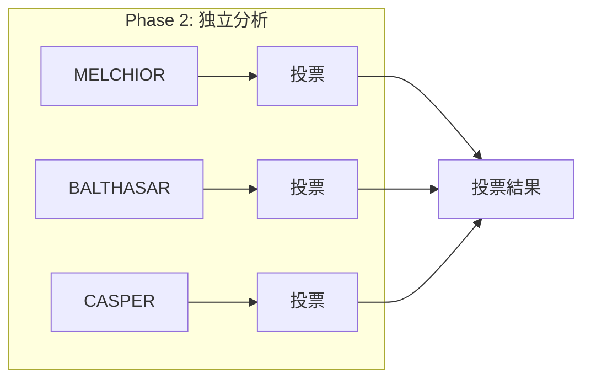
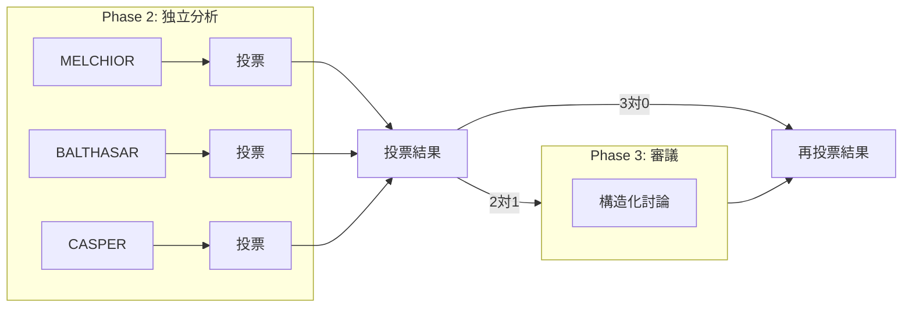
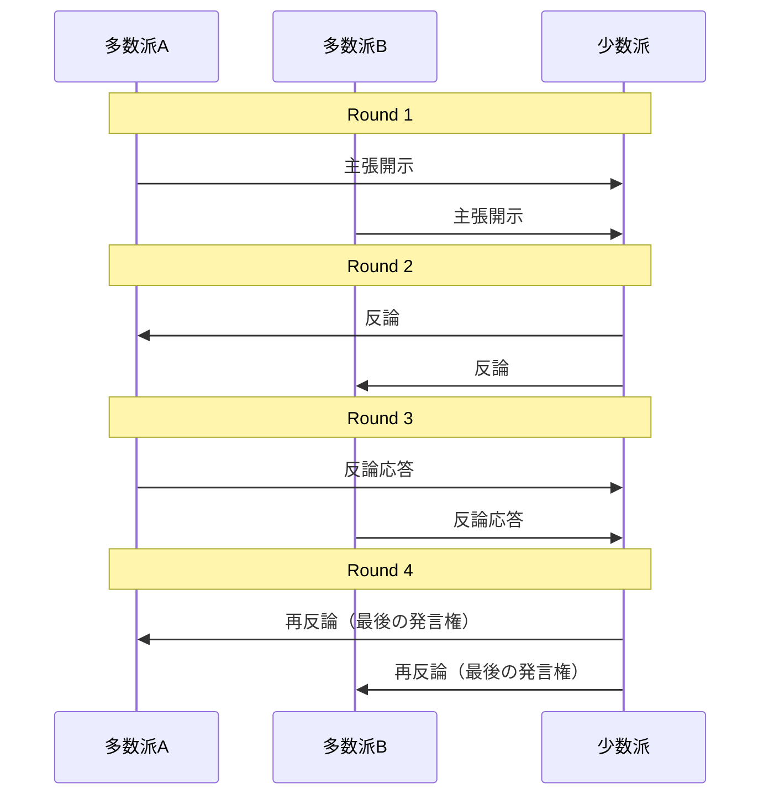

## TL;DR

- Claude Codeの最新機能「Agent Teams」を活用し、エヴァンゲリオンのMAGIを超える意思決定支援プラグイン「Super MAGI」を作った
- 3つのAIエージェントが投票するだけの多数決制から、意見が割れたら議論して再投票する討議民主制へ進化
- 審議フェーズの追加により、結論に至る検討の質と量が圧倒的に向上した。実務では結論よりもこの検討過程の出力が有用

https://github.com/yostos/claude-code-plugins

## はじめに

Claude Codeにプラグイン機能が追加されたとき、多くの開発者が同じことを考えたのではないでしょうか。「エヴァンゲリオンのMAGIシステムを作れるのでは」と。複数のAIエージェントに異なる視点から分析させて多数決で意思決定する仕組みは、プラグインの格好の題材です。実際、MAGIを模したプラグインを公開している方は少なくありません。

私も例に漏れず、昨年MAGIプラグインを作成しました。科学者・母親・女性という3つの人格を持つ独立したAIエージェントが、それぞれの視点から課題を分析し、多数決で結論を導くシステムです。Claude Codeで`/magi`と入力するだけで起動でき、引数に課題を渡す（例: `/magi リモートワークとオフィス出社のどちらを採用すべきか`）こともできます。当初は「面白い実験」程度の位置づけでしたが、使い続けるうちに意外なほど実用的だと気づきました。特に自分が書いた文書やコードのレビューでは、単一のAIに聞くより多角的な指摘が得られるため、日常的に活用するツールになっています[^self-review]。

そんな中、Claude CodeにAgent Team機能が発表されました。エージェント間でメッセージをやり取りできるこの機能を見て、「MAGIを発展させられるかもしれない」と考えました。投票するだけで終わっていたエージェントたちに、議論させることができるのです。この記事では、MAGIを「投票して終わり」のシステムから「議論してから投票する」システムへと進化させた、Super MAGIの設計思想と実装について紹介します。

## 従来のMAGIシステム

従来のMAGIは3つのフェーズで動作する、シンプルな多数決システムです。

- Phase 1（課題の構造化）: ARBITRATORがユーザーとの対話を通じて、課題を「命題・前提・A案・B案」の二択形式に整理する
- Phase 2（並列独立分析）: 3つのエージェントがTaskツールで並列起動され、互いの分析を見ることなく独立して調査・投票する
- Phase 3（最終裁定）: ARBITRATORが投票を集計し、多数決で結論を提示する

*Phase 2の実行画面。MELCHIOR、BALTHASAR、CASPERの3エージェントがバックグラウンドで並列実行されている*

3つのエージェントはそれぞれ異なる判断基準を持っています。

| エージェント | 視点 | 判断基準 |
|---|---|---|
| MELCHIOR | 科学者の視点 | 技術的実現性、効率性、スケーラビリティ、エビデンスの質 |
| BALTHASAR | 母親の視点 | 法令遵守、倫理的妥当性、リスク管理、弱者への影響 |
| CASPER | 女性の視点 | 感情的インパクト、UX、トレンド適合性、共感性 |

このシステムには1つの課題がありました。投票が2対1で割れた場合、少数派の意見は記録されるだけで、多数派に対して反論する機会が与えられません。少数派が重要な論点を持っていても、それが結論に反映されない可能性があるのです。

## Agent Teamsで実現するSuper MAGI

2026年2月、Claude Codeの新機能「Agent Teams」がリサーチプレビューとして発表されました[^agent-teams]。従来のサブエージェントでは各エージェントが独立に動くだけでしたが、Agent Teamsではエージェント同士が直接メッセージをやり取りできます。

この機能を見たとき、「MAGIで意見が割れた時、討論させるとどうなる？」と思いました。

従来のMAGIでは、投票が2対1で割れても少数派は意見を記録されるだけでした。

**従来のMAGI**

Agent Teamsを使えば、少数派が多数派に直接反論し議論を経て再投票するプロセスを実現できます。これは**多数決制から討議民主制への進化**です。「**Super MAGI**」への進化です。

Super MAGIは、従来のMAGIプラグインにAgent Teamsを活用した「審議フェーズ」を追加した拡張です。意見が割れた場合のみ審議フェーズが発動されます。

**Super MAGI（2対1の場合）**

構造化討論の内部では、4ラウンドのプロトコルで多数派に少数派が反駁するようメッセージを交換します。

| フェーズ | 使用API | 目的 |
|---|---|---|
| Phase 2（独立分析） | Taskツール (`run_in_background`) | 各エージェントが互いの分析を参照せず独立に調査・投票する |
| Phase 3（審議） | Agent Teams (`TeamCreate` / `SendMessage`) | 多数派と少数派が4ラウンドの構造化討論を行い再投票する |

:::message
現状の観察ではPhase 3が必ずしもAgent Teamsで実行されるとは限らず、サブエージェント（Taskツール）で代替されるケースも確認されています。Agent Teamsはリサーチプレビュー段階のため、今後の安定化に伴い挙動が変わる可能性があります。
:::

この「まず独立に考え、それから議論する」という順序が重要です。最初から議論させると、声の大きい意見に引きずられるリスクがあります。独立した分析を先に行うことで視点の多様性を担保し、その上でAgent Teamsの双方向通信を使って議論の質を高めます[^realworld]。

全会一致（3対0）の場合は審議フェーズをスキップし、従来と同じ動作をします。2対1の場合でも審議へ進むかどうかをユーザーに確認するため、不要なトークン消費を避けられます。

## 4ラウンド構造化討論プロトコル

審議フェーズの核心は、4ラウンドの構造化された討論プロトコルです。

| ラウンド | 発言者 | 内容 |
|---|---|---|
| Round 1: 主張開示 | 多数派 → 少数派 | 多数派の各エージェントが自らの分析と投票理由を少数派に提示する |
| Round 2: 反論 | 少数派 → 多数派 | 少数派が多数派の主張に対して反論する |
| Round 3: 反論応答 | 多数派 → 少数派 | 多数派が少数派の反論に対して応答する |
| Round 4: 再反論 | 少数派 → 多数派 | 少数派が再反論を行う。これが最後の発言機会となる |

このプロトコルには、手続き的公正さが構造として組み込まれています。

Round 1で多数派が先に主張を開示するのは、情報の非対称性を解消するためです。少数派は、多数派が何を根拠に判断したのかを知った上で反論を組み立てられます。

Round 4で少数派に最後の再反論の機会を与えるのは、数の不利を手続きで補うためです。多数派は2票という数の優位を持っています。少数派が最後に発言することで、多数派の反論応答に対して異議を述べられないまま結論が出ることを防ぎます。これはJ.S.ミルが提唱した「多数者の暴政」への対抗原理に基づく設計です[^mill]。

4ラウンドの議論を経た後、全エージェントが再投票します。議論に説得された場合はエージェントが立場を変更することもあり、最終出力では各エージェントの投票推移と変更理由が明示されます。

tmuxを使用していると、審議フェーズでは下図のように各エージェントのセッションが自動的に画面分割されます。エージェントが独立して動きながらメッセージをやり取りしている様子をリアルタイムに観察でき、本当に「議論している」感覚が得られます。

*審議フェーズの実行画面*

## Graceful Degradation

Agent Teamsはリサーチプレビューの実験的機能であるため、機能が完全に利用できない場合でも品質を落としつつ動作を継続する設計（Graceful Degradation）を組み込んでいます。具体的には従来のTaskツールによる独立分析と、Agent Teamsによる構造化討論を組み合わせたハイブリッドアーキテクチャを採用しています。

- TeamCreate失敗時: Phase 2の投票結果でそのまま最終裁定に進む
- エージェント応答なし: 応答しないエージェントのPhase 2投票を保持し、残りで議論を継続する
- TeamDelete失敗時: 警告を記録し、最終裁定は通常どおり実行する

すべてのエラーパスが「Phase 2の独立分析結果」にフォールバックする設計です。Phase 2の結果はエージェント独立性が保証された状態で生成されているため、審議が失敗しても意思決定の品質は従来のMAGIと同等に保たれます。

## 実例: トロッコ問題で何が変わるか

実際にSuper MAGIを試すため、歩道橋版トロッコ問題を従来のMAGIとSuper MAGIの両方で評価しました。命題は「制御不能のトロッコが5人の作業員に向かっている。橋の上にいる作業員Cを突き落とせばトロッコは止まるが、Cは確実に死ぬ。AはCを突き落とすべきか」というものです。

結論はどちらも同じでした。MELCHIOR（A案: 突き落とす）対BALTHASAR・CASPER（B案: 何もしない）の2対1でB案を採択しています。投票パターンも変わっていません。

変わったのは、結論に至るまでの議論の質です。

| 比較項目 | 従来のMAGI | Super MAGI |
|---|---|---|
| 分析の深度 | 各エージェント1段落の分析 | MELCHIORが8つの反論点、BALTHASARが11件の参照文献を提示 |
| 議論の可視性 | 最終結果のみ | 4ラウンドの反論・再反論の過程が記録される |
| 知的誠実性 | 各エージェントが独立に結論を述べるのみ | 多数派がMELCHIORの論点のうち認める部分を明示 |
| 少数派の扱い | 意見が記録されるだけ | 「法と道徳の分離」「5人の遺族に何と言うのか」等の鋭い反論を展開 |

特に印象的だったのは、多数派のBALTHASARとCASPERが再投票時に少数派MELCHIORの論点の一部を認めた点です。BALTHASARはルール功利主義による臓器移植問題回避の部分的有効性を、CASPERはダマシオの循環論法の指摘の妥当性を、それぞれ認めています。立場は変えないが、相手の論拠の正当な部分は認める。この知的誠実さは、独立投票だけでは生まれません。

Super MAGIがもたらしたのは「結論の変更」ではなく「結論の頑健性の確認」でした。議論を経ても覆らなかった事実は、結論への信頼を高めてくれます。もちろん、議論によって結論が逆転するケースもあり得ます[^article-review]。そのときこそ審議フェーズの真価が発揮されるでしょう。

実務においてMAGIを使うとき、実は最終的な「A案とB案のどちらか」という結論そのものよりも、結論に至る過程で提示される分析のほうが役に立ちます。どのような観点から検討され、どの論拠が有効で、どこに弱点があるのか。審議フェーズで交わされる反論と再反論は、自分では気づけなかった論点を浮き彫りにしてくれます。MAGIの本当の価値は「答えを出す」ことではなく「考える材料を揃える」ことにあると感じています。

なお、分量は従来の約50行に対してSuper MAGIは約220行と4倍以上になります。深い分析と簡潔さはトレードオフの関係にあるため、全会一致の場合に審議をスキップする設計が効いてきます。

## まとめ

Super MAGIは、Claude CodeのAgent Teams機能を活用して、マルチエージェントの意思決定を「投票して終わり」から「議論してから投票する」へと進化させました。

設計上のポイントをまとめます。

- 独立性の確保: まず独立に分析し、その後に議論する。順序を守ることで視点の多様性を維持する
- 選択的活性化: 全会一致なら審議不要。意見が割れたときだけ深掘りする
- 構造化された公正: 少数派に最終発言権を保証し、数の不利を手続きで補う
- 安全な退避: すべてのエラーが独立分析結果にフォールバックする

プラグインはGitHubで公開しています。Claude Codeユーザーであれば、インストールして`/magi`コマンドで試すことができます。

[^agent-teams]: Claude Opus 4.6と同時に発表。1つのセッションがチームリーダーとなり、複数のエージェントをチームメイトとして起動し、`SendMessage`でメッセージを交換できる。詳細は[公式ドキュメント](https://code.claude.com/docs/en/agent-teams)を参照。
[^self-review]: 実際にSuper MAGIのコンセプト文書と要件定義書もMAGI自身でレビューしており、いずれも3対0の全会一致で承認されています。検証結果はリポジトリの`docs/`ディレクトリに収録しています。
[^article-review]: 実際にこの記事のレビューで逆転が起きました。当初2対1（B案: 改善が必要）に割れましたが、審議フェーズを経て3対0（A案: 公開に値する）の全会一致に逆転しています。
[^realworld]:  現実社会でもこうありたいものです。
[^mill]: J.S.ミル『自由論』(*On Liberty*, 1859)。多数派が少数派の意見を抑圧する「[多数者の暴政](https://en.wikipedia.org/wiki/Tyranny_of_the_majority)」を批判し、たとえ全人類が1つの意見を持ち一人だけが反対意見を持つとしても、その一人を沈黙させることは正当化されないと主張した。
