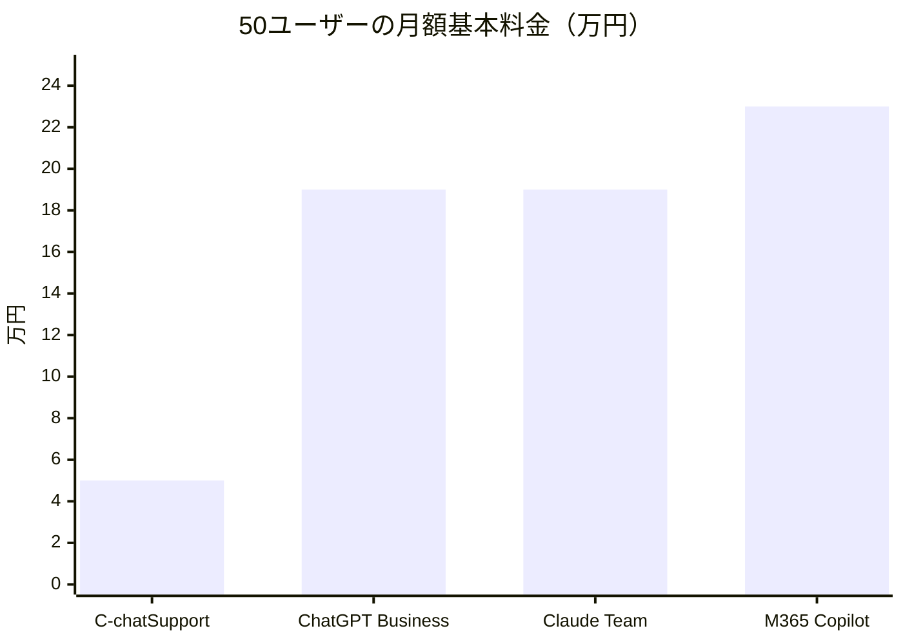

生成AIを業務に導入したいが、ChatGPTやClaudeを直接使わせるのはセキュリティ上不安がある。そんな企業の声に応えるかたちで、「安全に使える法人向け生成AIサービス」を謳うサービスが次々と登場しています。

身近で話題に登ったことをきっかけに調べてみた、ちばぎんコンピューターサービスが提供する「C-chatSupport」もそのひとつです。

https://www.ccsnet.co.jp/service/c-chatsupport/

本記事では、このサービスの公開情報をもとに技術者の視点から、この種の「ラッパーサービス」に共通する構造的な問題点を整理します。

:::message alert
以下の分析はすべて2026年2月時点のWebサイト上の公開情報にもとづく筆者個人の見解であり、サービスの内部実装を直接検証したものではありません。実際のサービスには公開されていない機能や価格優位性がある可能性があります。導入を検討される際は、各サービス提供者の最新情報を直接ご確認ください。
:::

## 本質的に「APIラッパー」にすぎない

この種のサービスの実態は、OpenAIやAnthropicなどの既存LLM APIにRAG機能とWebUIを被せたものです。独自のモデルや技術的な差別化要素は見当たりません。

C-chatSupportの場合、Webサイトでは「複数の生成AIモデルが利用可能」と謳っていますが、具体的なモデル名は一切記載されていません。アーキテクチャ図、データフローの説明、API仕様、SLAといった技術情報も公開されていません。公式ブログやプロモーション動画でもRAGを「社内情報からも参照して回答させる技術」と一般的な用語説明に留まり、自社実装の独自性には触れていません。紹介されている「メール作成時間75%削減」といった効果も、ChatGPTやClaudeを直接使えば同様に得られるものです。

技術者の立場から見ると、これは独自技術がないことの裏返しと判断せざるを得ません。自社開発の技術があれば、それこそが最大の差別化ポイントであり、積極的に公開するはずです。

ChatGPT Business、Claude Team、Microsoft Copilotといった一次提供者のサービスは、利用可能なモデル、性能ベンチマーク、データの取り扱いポリシー、コンプライアンス認証などを詳細に公開しています。技術的な透明性を担保できないサービスを、あえて間に挟む合理性はありません。

## 価格設定への疑問

C-chatSupportの場合、月額5万円（キャンペーン価格、通常7万円）で50ユーザーまで利用可能で、さらに従量料金が別途かかります。一見すると安価に見えますが、他のサービスと50ユーザーの月額基本料金で比較してみます（海外サービスは1ドル=約150円で換算）。

C-chatSupportの基本料金は確かに最安値です。しかし、これには従量課金が含まれていません。従量料金の単価も非公開のため、実際の月額コストは利用量次第で大きく変動します。一方、他のサービスは基本的に定額制です。なお、M365 CopilotはMicrosoft 365 E3/E5等のベースライセンスが別途必要であり、実際のコストは上記の金額より高くなります。

さらに重要なのは、この価格で得られる機能の差です。

| 機能           | C-chatSupport | ChatGPT Business | Claude Team | M365 Copilot |
| -------------- | :-----------: | :--------------: | :---------: | :----------: |
| チャット       |       ○       |        ○         |      ○      |      ○       |
| RAG/ナレッジ   |       ○       |        ○         |      ○      |      ○       |
| 画像生成       |       -       |        ○         |      -      |      ○       |
| コード実行     |       -       |        ○         |      ○      |      -       |
| Office連携     |       -       |        -         |      -      |      ○       |
| 管理コンソール |    非公開     |        ○         |      ○      |      ○       |
| SLA            |    非公開     |        ○         |      ○      |    99.9%     |
| 料金体系       |   基本+従量   |       定額       |    定額     |     定額     |

基本料金だけを見ると安く映りますが、従量課金を含めたトータルコストと機能差を考慮すると、割高になる可能性が高いです。特に「従量料金が非公開」という点は、予算管理の観点からも大きなリスクです。

## セキュリティの訴求が誤解を招く

この種のサービスは「情報漏洩リスク無し」「社外にデータを出さない」といったセキュリティを前面に押し出す傾向があります。しかし、複数の生成AIモデルを利用可能としている以上、バックエンドではOpenAIやAnthropic等の外部APIを呼んでいるはずです。

「学習に使わない」という点はAPI利用規約上当然のことであり、このサービス固有の強みではありません。また「社外にデータを出さない」という表現は、APIリクエスト自体が外部サーバーへの通信を伴う以上、厳密には正確ではありません。Azure OpenAI Serviceのプライベートエンドポイントなどを使っている可能性はありますが、そうした技術的な裏付けの説明がない以上、顧客に誤った安心感を与えるリスクがあります。

技術的な根拠を示さずに「安全」を訴求するサービスは、むしろ警戒すべきです。

## 機能の陳腐化リスク

紹介されているユースケース（議事録作成、DM作成、データ分析、マクロ生成）は、ChatGPT、Copilot、Claude等の汎用AIサービスで既にできることばかりです。

LLMの進化は非常に速く、ラッパーサービスは元のモデル提供者が同等機能をネイティブに実装した時点で価値を失います。実際、RAGについてもClaude、ChatGPT、Geminiのいずれもファイルアップロードとナレッジ検索を標準機能として提供済みです。ラッパーの「付加価値」は、モデル提供者自身がすぐに追い越してしまいます。

## ベンダーロックインと発展性の懸念

地銀グループのSIer子会社のように、AI技術が本業ではない提供元の場合、開発リソースや投資規模は限られます。LLM分野のイノベーション速度に追随し続けられるかは疑問です。

また、導入後に乗り換えたくなった場合、RAGに蓄積したナレッジデータのポータビリティも不透明です。独自フォーマットでロックインされていれば、移行コストは高くつきます。

## 乱立するラッパーサービス

この種のラッパーサービスは市場に溢れかえっています。

AIsmileyが2025年10月に公開した「生成AIチャットボットカオスマップ」には、国内だけで140製品以上が掲載されています。デロイト トーマツ ミック経済研究所の調査によると、法人向け生成AI導入ソリューション市場は2024年度の330億円から2025年度は503億円（前年比152%）、2026年度は720億円（同143%）へと急拡大しています。この成長市場を狙って、SIerやIT企業が「法人向け生成AIチャット」を次々と投入しているのが現状です。

なぜこれほどサービスが乱立するのか。理由は単純で、参入障壁が極めて低いからです。Difyのようなオープンソースの生成AIアプリ構築プラットフォームを使えば、RAG機能付きのチャットボットをノーコード・1日で構築できます。LLMのAPIキーを設定し、社内文書をアップロードし、チャットUIを公開する。技術的にはこれだけです。つまり、140以上のサービスの大半は、同じようなOSSやクラウドサービスの上に薄いカスタマイズを加えただけの可能性が高いということです。

参入障壁の低さは、撤退障壁の低さと表裏一体です。市場の飽和で採算が合わなくなれば、サービス終了のリスクも現実的です。

## まとめ

組織が生成AIサービスの導入を検討する際には、「なぜChatGPT Business/Enterprise、Claude Team、Microsoft Copilot、あるいはAmazon Bedrock上の自前構築ではなく、このサービスなのか」という問いに明確に答えられる必要があります。

唯一の合理的な理由があるとすれば、既存の取引関係や日本語でのサポート体制といった非技術的な要素でしょう。実際には「海外サービスはよく分からないから、馴染みのベンダーに任せよう」と、技術選定に関与しない経営層の判断で導入が決まるケースも多いのが実情です。しかし、その安心感がラッパーサービスの構造的な弱点に見合うコストかどうかは、慎重に見極めるべきです。

技術的な差別化が不明確なサービスへ毎月の利用料を支払い続けるよりも、ChatGPT Business、Claude Team、Copilotの直接契約、あるいはAmazon BedrockやAzure OpenAI Serviceによる自前構築のほうが、長期的にはコスト・機能の両面で有利です。「生成AIは難しそうだから専門家に任せたい」という不安に応えるだけのサービスへ、安易に飛びつかないことが重要です。
