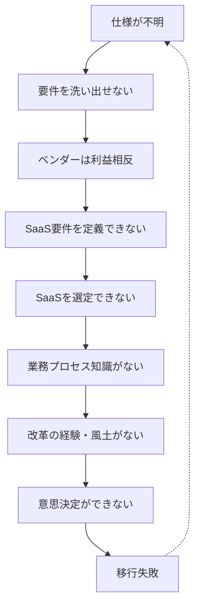

## TL;DR

中小企業や自治体などIT部門が弱い組織では、10年、20年と塩漬けになったシステムからの脱却が「無理ゲー」に陥りやすい傾向があります。ブラックボックス化・ベンダーロックイン・組織能力不足という問題が互いに絡み合い、負のスパイラルを形成するからです。

根本原因は技術ではなく、組織的なITガバナンスの喪失にあります。この状況からの脱出には膨大な投資と経営層の強いコミットメントが必要ですが、そもそもこの状況に陥らないための予防が最善策です。

## はじめに

:::message
本記事は複数の事例をもとに典型的なパターンとして再構成したものです。特定の組織や個人を指すものではありません。
:::

IT部門を持たず塩漬けになったシステムで悩む組織では、保守の手間がかからないSaaSへの移行を検討することが多いでしょう。しかし、SaaSであれ新規開発であれ、長年運用してきた塩漬けシステムからの刷新は、想像以上に困難を極めます。

ITプロジェクトの失敗率は決して低くありません。Standish Groupの[CHAOS Report 2020](https://www.standishgroup.com/)によれば、ITプロジェクトの約70%が当初の目標を達成できないとされています。特に、知見をもった要員が途絶えドキュメンテーションも十分でないシステムからの移行は、その中でも最も困難なカテゴリに属します。

本記事では、筆者が見聞した複数の事例をもとに、システム刷新が「無理ゲー」と化す構造的な問題を解説します。これは特殊な例ではなく、多くの組織が陥りがちな普遍的なパターンです。

## 前提：この記事が想定する組織像

本記事で分析する「システム刷新が困難な組織」には、以下のような特徴があります。

- CIOが不在で、組織的なIT統制がない
- 専任のIT部門が存在しない、または機能していない
- システム開発・保守を長年同じベンダーに依存してきた
- 仕様書・設計書が最新化されておらず、組織内で管理できていない
- ソースコードの所在や最新版の把握ができていない

このような状態は、中小企業や地方自治体、非IT企業の事業部門などで珍しくありません。

## 1. システムの完全なブラックボックス化

長年の運用の中で、システムは以下のような状態に陥っています。

- 仕様書・設計書が存在しない、または最新でない
- 現在のシステムが何をしているのか誰も把握していない
- 信頼できるのはソースコードのみだが、組織では管理していない
- ソースコードの可読性が低く、設計意図の理解が困難

さらに深刻なのは、文書化されていない知識の存在です。暗黙知化した業務ルールが大量のコード内へ埋め込まれており、誰も覚えていない例外処理が実は重要な機能だったりします。文書化されていない仕様変更の積み重ねが、現在の動作を形成しています。

## 2. ベンダーロックインの完成形

このような状況では、ベンダーとの力関係が完全に逆転します。ベンダーだけがシステムの知識を持っており、組織側には検証手段がなく、ベンダーの言い値を受け入れるしかありません。ベンダー自身も変更時の検証で対応しているだけで、完全な仕様把握は疑問です。これは典型的なベンダーロックインの完成形です。

現行ベンダーに移行支援を依頼することも、構造的に困難です。唯一システムのナレッジを持っている彼らは、現行システムの保守で継続的な収益を得ています。システム刷新が現行ベンダー以外へのSaaS移行などの場合、積極的に協力するインセンティブがなく、むしろ移行は現状のビジネス機会の損失を意味します。

## 3. システム刷新に必要な組織能力

システム刷新を成功させるには、現行システムの分析と要件定義、業務プロセスの文書化が必要です。また多くの場合そのような組織ではSaaS製品を検討するでしょう。SaaSを選択したとしても、SaaS製品の選定とギャップ分析、業務プロセス改革の設計と実行、データ移行、段階的な移行と検証、運用体制の確立といったステップが必要です。

これらを遂行するには、以下の能力が不可欠です。名のある大企業でも全て満たしていることは稀です。

- 現行システムの仕様を理解し文書化する能力
- 業務要件を定義し、システム要件に落とし込む能力
- プロジェクト全体を管理する能力
- SaaSやERPを移行先とする場合は、その製品が前提とする業務プロセスを理解するナレッジ
- 業務改革やプロセスリエンジニアリングを推進する能力
- 経営層の高いコミットメントとリーダーシップ

## 4. 3つの致命的なギャップ

1. **移行の「正解」が誰にも分からない** — 仕様書が古いため、現在のシステムがどう動いているか不明である。つまり「移行後に何が実現されていればOKなのか」という基準が存在しない。
2. **投資を正当化できない** — 移行には膨大な投資が必要だが、現状維持のためだけでは経営層の投資判断を得られない。明確なビジネス成果や価値を経営層がコミットできなければ、必要な予算確保は不可能である。
3. **組織風土の問題** — 能力不足だけでなく、組織文化にも課題がある。経営層が成果をコミットするリーダーシップがなく、トップダウンでの業務改革の経験もない。大きな変革を受け入れる風土が醸成されておらず、現場の抵抗を乗り越えて改革を推進する仕組みもない。データや機能を諦めるような大胆な意思決定ができない。

## 5. 負のスパイラル

塩漬け状態から脱却しようとSaaS移行を決意しても、これらの問題が互いに絡み合い、負のスパイラルを形成します。

では新規ベンダーに依頼すればよいのでしょうか。残念ながら、それも困難です。現行システムの仕様不明により要件定義ができず、リバースエンジニアリングには膨大なコストがかかります。組織側に要件定義能力がなくプロジェクトは進まず、責任範囲も不明確でリスクを引き受けられません。優れたSIerやコンサル会社ほど、このような案件を忌避します。

## 6. 無理に進めた場合の予想シナリオ

仮に予算化されて、無理やりSaaS移行プロジェクトが開始されたとします。典型的な失敗パターンは以下の通りです。

| フェーズ | 時期        | 起こること                                                                                                                                                             | 経営層の認識         |
| :------- | :---------- | :--------------------------------------------------------------------------------------------------------------------------------------------------------------------- | :------------------- |
| 現状分析 | 1〜3ヶ月目  | コンサルに高額費用を払うが、仕様書が古く現場も「なんとなく使っている」状態。表面的なヒアリングで不完全な要件定義書が作成され、重要な例外処理や暗黙のルールは抜け落ちる | 「順調に進んでいる」 |
| SaaS選定 | 4〜8ヶ月目  | 不完全な要件定義書をもとにSaaS製品を選定。「カスタマイズすれば何とかなる」と判断するが、SaaSのカスタマイズには限界がある。データ移行計画も曖昧。予算は当初の2倍に膨張  | 「想定内の追加投資」 |
| 移行実施 | 9〜12ヶ月目 | 全面移行を強行し現場は大混乱。「以前できたこと」ができない、例外処理の欠落が判明、過去データが参照できず業務停止。現場から「前のシステムに戻せ」の声                   | 「現場の抵抗」と認識 |
| 破綻     | 12ヶ月目〜  | 現行システムは停止済みで戻せない。手作業やExcelで応急対応。ベンダーは「要件定義が不十分だった」と責任回避。業務効率は移行前より悪化。責任者が退職                      | 責任問題に発展       |

## 7. 唯一の対応策

本気で脱出するなら、以下の対策が必要です。これは「超ハードモード」であることを認識してください。

まず、業務プロセスリエンジニアリング能力の確保が必要です。SaaSの前提とする業務プロセスを理解し、現行業務を可視化した上でSaaSに適応させる能力が必須であり、経験豊富な外部コンサルの支援が必要になります（高額）。

次に、捨てる覚悟と意思決定です。現行システムの機能やデータの一部を諦める大胆な意思決定が不可欠であり、「今と同じことができる」を目指すと必ず失敗します。

そして、現場の抵抗を押し切るコミットメントが絶対条件です。現場の抵抗をトップダウンで押し切る経営層の覚悟と、相応の予算を得る交渉力も必須です。

なお、移行手法として「ストラングラーパターン」（Strangler Fig Pattern）と呼ばれる段階的移行が有効です。一気に全面移行せず、新機能をSaaSで構築しながら徐々に旧システムの機能を絞めていく手法です。リスクを分散でき、途中で軌道修正も可能ですが、この手法を採用するには移行期間中の並行運用コストを許容できることが前提条件となります。

これらの対策には膨大な投資が必要です。この規模の投資を経営判断として通すには、業務効率化による大幅なコスト削減、新規事業での大きな経済効果の実現、競争優位性の獲得といった、明確で大きなビジネス成果を示す必要があります。単なる「技術的負債の解消」では、この規模の投資は正当化できません。

:::message
**超ハードモードをクリアした事例：浜松倉庫株式会社**
静岡県の中堅倉庫会社である[浜松倉庫](https://www.hamamatsu-soko.co.jp/)は、長年使い続けたスクラッチ開発の倉庫管理システム（WMS）を3年かけて刷新し、経済産業省「DXセレクション2024」でグランプリを受賞しました。社内にDX人材が1人もいない状態からの出発でした。成功の鍵は以下の3点でした。

1. **経営層の全面的コミット** — 社長が「10年後、20年後の会社の在り方を考えてほしい」と若手管理者に問題提起し、従業員主体で徹底的に議論させた
2. **段階的なアプローチ** — 3年間を4段階に分け、ビジョン策定→課題掘り下げ→仕様書作成→導入運用と進めた
3. **時間をかける覚悟** —「もし1年でやれと言われたら失敗していた」（取締役談）

参考：[J-Net21 浜松倉庫事例](https://j-net21.smrj.go.jp/special/dx/20240924.html)
:::

## 8. 自己診断チェックリスト

自組織がこの「無理ゲー」状態に陥っていないか、以下のチェックリストで確認してください。該当項目が多いほど、移行リスクが高い状態です。

**システム管理の状態**

- [ ] 現行システムの最新の仕様書・設計書が組織内に存在しない
- [ ] ソースコードの所在や最新版を把握していない
- [ ] システムの全機能を説明できる社内担当者がいない

**ベンダー関係**

- [ ] 5年以上同じベンダーにシステム保守を依存している
- [ ] ベンダーの見積もりを検証する手段がない
- [ ] ベンダー変更を検討したことがない、または断念した

**組織能力**

- [ ] CIOまたはIT統括責任者が不在である
- [ ] 業務要件を自ら定義した経験がない
- [ ] トップダウンでの業務改革を実施した経験がない

**3項目以上該当する場合は要注意です。** まずは小さな領域から仕様の可視化と文書化を始め、段階的にIT統制能力を高めていくことを検討してください。

## まとめ：経営への教訓

この状況は技術的な問題というより、組織的なガバナンスの喪失が根本原因です。

現状維持を続けるなら、ベンダーロックインの継続と保守費用の高騰を受け入れるしかありません。脱出を目指すなら、膨大な投資と困難なプロジェクト遂行が必要です。しかもその投資は、大きなビジネス成果とセットで経営層がコミットした場合のみ正当化できます。

「システム刷新」は手段であり、目的ではありません。安易なIT投資と組織的なIT統制能力の放棄が、いかに高いツケとなって返ってくるかを示す典型例です。

**まだ間に合う組織へ：今日から始められる予防策**

このような状況を避けるため、以下の具体的なアクションを今日から始めてください。

1. **仕様書・設計書の管理体制を確立する** — ConfluenceやNotionなどのドキュメント管理ツールを導入し、システム仕様を組織内で一元管理する仕組みを作る。ベンダーが作成した文書も必ず組織内に保管する。

2. **API仕様を可視化する** — SwaggerやOpenAPI形式でシステム間連携の仕様を文書化しておくと、将来の移行時に大きな資産となる。

3. **定期的な棚卸しを実施する** — 年1回程度、システムの機能一覧と利用状況を棚卸しし、不要な機能の廃止や仕様の最新化を行う。

4. **複数ベンダーとの関係を維持する** — 現行ベンダー以外とも定期的に情報交換し、技術動向の把握と比較検討の材料を確保する。

5. **社内にIT人材を育成する** — 外部に完全依存せず、最低限の技術判断ができる人材を社内に確保する。

**すでにこの状況に陥っている組織へ**

絶望する必要はありません。ただし、短期間での劇的な改善は期待できません。まずは経営層の理解を得ることから始め、小さな領域から段階的に状況を改善していくアプローチが現実的です。最初の一歩は、現状を正確に把握し、経営層と共有することです。

---

この記事が参考になったら、ぜひ「いいね」やコメントをお願いします。皆さんの組織での経験談や、成功・失敗事例もぜひコメントで共有してください。
